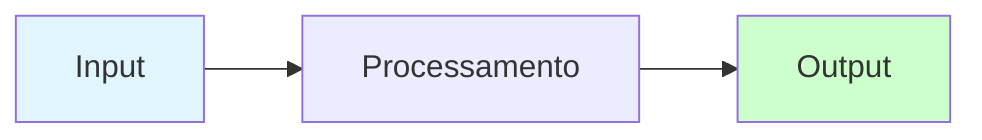

# Instruções GitHub Copilot - Dominando Agentes de IA

## 📚 Sobre o Projeto

Este repositório contém o livro **"Dominando Agentes de IA"**, um guia prático e técnico para construção de sistemas de agentes inteligentes usando LLMs. O livro combina teoria fundamentada com exemplos práticos executáveis, focando em aplicações reais de produção.

**Público-alvo**: Engenheiros de software, cientistas de dados e desenvolvedores que desejam construir agentes de IA robustos e escaláveis.

---

## 🏗️ Estrutura do Repositório

```
dominando-agentes-ia/
├── book/                           # Conteúdo do livro (Quarto)
│   ├── chapters/                   # Capítulos organizados por partes
│   │   ├── part-01/                # Parte I: Fundamentos
│   │   ├── part-02/                # Parte II: Construindo Sistemas de Agentes
│   │   └── part-03/                # Parte III: Arquitetura e Produção
│   ├── datasets/                   # Datasets para exercícios práticos
│   ├── sandbox/                    # Exemplos de código e experimentos
│   ├── _quarto.yml                 # Configuração principal do livro
│   ├── references.bib              # Referências bibliográficas (BibTeX)
│   └── index.qmd                   # Página inicial
├── docs/                           # Documentação de planejamento
│   ├── sumario.md                  # Estrutura completa do livro
│   ├── estrutura.md                # Filosofia e objetivos
│   └── projeto_guia.md             # Guia de desenvolvimento do agente de exemplo
```

---

## ✍️ Padrões de Escrita do Livro

### 1. **Formato e Estrutura**

- **Formato**: Quarto Markdown (`.qmd`)
- **Idioma**: Português brasileiro (pt-BR)
- **Tom**: Técnico mas acessível, com analogias QUANDO apropriado
- **Estrutura de capítulos**:
  ```markdown
  # Capítulo X: Título {.unnumbered}

  ## Introdução/Contexto
  ## Conceitos Fundamentais
  ## Seção Técnica 1
  ## Seção Técnica 2
  ## Exercícios Práticos
  ## Conclusão
  ```

### 2. **Código e Exemplos**

**Sempre que incluir código:**

```python
# ✅ BOM: Código completo e executável

# Instalação necessária
# pip install transformers torch

import torch
from transformers import AutoModelForCausalLM, AutoTokenizer

def exemplo_funcional():
    """
    Docstring clara explicando o que a função faz.

    Returns:
        Descrição do retorno
    """
    # Comentários explicativos inline
    model = AutoModelForCausalLM.from_pretrained("gpt2")

    # Mais código...
    return resultado

# Exemplo de uso
resultado = exemplo_funcional()
print(f"Resultado: {resultado}")
```

**Evite:**
```python
# ❌ RUIM: Código incompleto ou pseudocódigo sem contexto

model = load_model()  # De onde vem load_model?
result = process()     # Faltam imports e definições
```

**Regras para código:**

- Sempre incluir imports necessários
- Adicionar comentários `# uv pip install ...` para dependências
- Usar docstrings em funções
- Incluir exemplo de uso após definições
- Tratar erros quando apropriado
- Código deve ser sempre executável (copy-paste-run)
- Todos os exemplos devem estar no corpo do texto e também em um arquivo separado na pasta `sandbox/`

### 3. **Callouts e Avisos**

Use callouts Quarto para destacar informações importantes:

```markdown
::: {.callout-note title="Título Opcional" appearance="simple"}
Informação complementar ou explicação adicional.
:::

::: {.callout-tip title="Dica Prática"}
Sugestões úteis para aplicação prática.
:::

::: {.callout-warning title="Atenção"}
Avisos sobre limitações, trade-offs ou armadilhas comuns.
:::

::: {.callout-important title="Importante"}
Informação crítica que não pode ser ignorada.
:::
```

**Quando usar cada tipo:**

- **note**: Explicações adicionais, contexto histórico, matemática opcional
- **tip**: Dicas práticas, otimizações, melhores práticas
- **warning**: Limitações, problemas éticos, trade-offs
- **important**: Conceitos críticos, decisões de arquitetura

### 4. **Diagramas e Visualizações**

Use Mermaid para diagramas técnicos:

```markdown

```

**Tipos comuns:**

- `graph LR/TD`: Fluxogramas
- `sequenceDiagram`: Interações entre componentes
- `classDiagram`: Estruturas de dados

### 5. **Referências Bibliográficas**

**Ao citar papers:**
```markdown
O Transformer [@vaswani2017attention] revolucionou NLP.

Múltiplas citações [@brown2020language; @devlin2018bert].
```

**Adicionar ao `references.bib`:**

```bibtex
@inproceedings{vaswani2017attention,
  title={Attention Is All You Need},
  author={Vaswani, Ashish and Shazeer, Noam and ...},
  booktitle={NeurIPS},
  year={2017},
  url={https://arxiv.org/abs/1706.03762}
}
```

**Regras:**

- Sempre adicionar URL (preferencialmente fontes abertas de conteúdo como arXiv ou DOI)
- Incluir nota explicativa quando útil (`note = {...}`)
- Verificar se citação já existe antes de adicionar duplicata
- Usar formato consistente (chave: sobrenome+ano+palavra-chave)
- **IMPORTANTE: Múltiplos autores**
  - Listar os **3 primeiros autores** completos
  - Adicionar `and others` (BibTeX renderizará como "et al" automaticamente)
  - **NUNCA** usar `and ...` ou deixar lista incompleta sem `and others`
  - Exemplo correto: `author = {Brown, Tom B. and Mann, Benjamin and Ryder, Nick and others}`
  - Exemplo INCORRETO: `author = {Brown, Tom B. and ...}` ou `author = {Brown, Tom B.}`

### 6. **Exercícios Práticos**

**Estrutura padrão:**

```markdown
### Exercício N: Título Descritivo

**Objetivo:** Explicar claramente o que o leitor vai aprender.

**Por que esse exercício?** Justificar relevância prática.

**Passo a Passo:**

```python
# Código completo e executável
# com comentários detalhados
```

**Desafios adicionais:**

1. Extensão do exercício para aprofundamento
2. Variação para explorar conceito relacionado

**Questões para reflexão:**

1. Pergunta que estimula pensamento crítico
2. Conexão com aplicações reais
```

Regras para exercícios:

- Sempre incluir objetivo claro
- Justificar por que é relevante
- Código deve ser copy-paste-run
- Incluir desafios opcionais para leitores avançados
- Terminar com questões reflexivas

---

## 🎯 Padrões Técnicos Específicos

### Tokenização

**Terminologia consistente:**

- utilize itálico para termos em inglês
- "tokenização" (não "tokenization")
- "subword tokenization" (manter em inglês quando termo técnico)
- "BPE (Byte-Pair Encoding)" na primeira menção, depois apenas "BPE"
- "fertility rate" explicado como "taxa de fertilidade" com definição

**Exemplo:**

```markdown
*Fertility* rate mede quantos tokens são necessários, em média, para representar
uma palavra. Calculado como: `Total de Tokens / Total de Palavras`.
```

---

## 🔧 Workflow de Desenvolvimento

### Ao Adicionar/Modificar Capítulos

1. **Verificar estrutura**:

   - Cabeçalho correto: `# Capítulo X: Título {.unnumbered}`
   - Seções bem organizadas
   - Exercícios práticos ao final (caps 2+)
   - Conclusão que resume conteúdo entregue

2. **Validar código**:

   - Testar todos os exemplos
   - Verificar imports e dependências
   - Garantir que é copy-paste-run

3. **Revisar referências**:

   - Todas citações existem em `references.bib`?
   - URLs funcionam?
   - Formato consistente?

4. **Atualizar `_quarto.yml`**:

   - Adicionar novo capítulo na lista correta
   - Verificar ordem dos capítulos
   - Descomentar linha quando capítulo estiver pronto

### Ao Criar Datasets

**Localização**: `book/datasets/`

**Formato**: JSONL (JSON Lines)

**Exemplo:**

```jsonl
{"input": "Pergunta ou prompt", "output": "Resposta esperada", "metadata": {...}}
{"input": "Próximo exemplo", "output": "Próxima resposta", "metadata": {...}}
```

**Regras:**

- Um exemplo por linha (JSONL)
- Campos consistentes entre exemplos
- Metadata opcional mas útil (`task`, `difficulty`, etc.)
- Mínimo 20-50 exemplos para exercícios
- Documentar origem/licença se dataset não for original

---

## 📊 Checklist de Qualidade

Antes de considerar um capítulo "completo", verificar:

- [ ] **Conteúdo**
  - [ ] Progressão lógica de conceitos
  - [ ] Analogias e exemplos claros
  - [ ] Limitações e trade-offs discutidos honestamente

- [ ] **Código**
  - [ ] Todos exemplos testados e funcionais
  - [ ] Imports e dependências documentados
  - [ ] Comentários explicativos adequados

- [ ] **Exercícios**
  - [ ] Objetivos claros
  - [ ] Código executável
  - [ ] Progressão de dificuldade
  - [ ] Datasets necessários criados

- [ ] **Formatação**
  - [ ] Callouts usados apropriadamente
  - [ ] Diagramas renderizam corretamente
  - [ ] Referências bibliográficas completas

- [ ] **Conclusão**
  - [ ] Resume apenas conteúdo entregue
  - [ ] Conecta com próximo capítulo
  - [ ] Destaca aplicações práticas

---

## 🚨 Erros Comuns a Evitar

### ❌ **Não Faça:**

1. **Prometer conteúdo não entregue na conclusão**
2. **Código incompleto ou pseudocódigo sem aviso**
3. **Citar referências inexistentes**
4. **Exercícios sem datasets**
5. **Ignorar limitações ou problemas éticos**

### ✅ **Sempre Faça:**

1. **Testar código antes de incluir**
2. **Verificar que referências existem**
3. **Incluir prerequisitos explícitos**
4. **Discutir limitações honestamente**
5. **Fornecer contexto prático (por que isso importa?)**

---

## 📖 Recursos de Referência

- **Quarto Docs**: https://quarto.org/docs/
- **Mermaid Docs**: https://mermaid.js.org/
- **BibTeX Guide**: https://www.bibtex.com/g/bibtex-format/
- **Python Style Guide**: PEP 8 (https://peps.python.org/pep-0008/)

--- 

**Última atualização**: 2025-01-04
**Versão do Copilot Instructions**: 2.0
