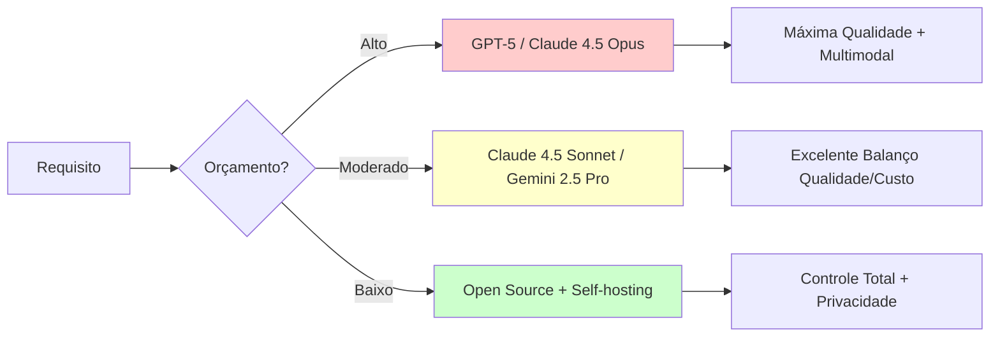

# Apêndice A: Comparação de Modelos {.unnumbered}

Este apêndice fornece tabelas comparativas detalhadas dos principais LLMs e modelos de embeddings discutidos no livro, facilitando a escolha do modelo adequado para cada caso de uso.

---

## LLMs: Modelos de Linguagem

### Modelos Proprietários

| Modelo | Provedor | Parâmetros | Context Window | Custo ($/1M tokens) | Especialização |
|--------|----------|------------|----------------|---------------------|----------------|
| **GPT-5** | OpenAI | Não divulgado | 256K | Input: $15 / Output: $45 | Raciocínio multimodal avançado |
| **GPT-4.5 Turbo** | OpenAI | ~2T (estimado) | 256K | Input: $8 / Output: $24 | Raciocínio geral, código |
| **GPT-4o** | OpenAI | ~1.76T | 128K | Input: $5 / Output: $15 | Multimodal nativo (visão, áudio) |
| **GPT-4 Turbo** | OpenAI | ~1.76T | 128K | Input: $10 / Output: $30 | Raciocínio geral, código |
| **Claude 4.5 Opus** | Anthropic | Não divulgado | 500K | Input: $12 / Output: $60 | Raciocínio complexo, context extremo |
| **Claude 4.5 Sonnet** | Anthropic | Não divulgado | 500K | Input: $2.50 / Output: $12 | Análise longa, código, rápido |
| **Claude 3.5 Sonnet** | Anthropic | Não divulgado | 200K | Input: $3 / Output: $15 | Legacy, código |
| **Gemini 2.5 Ultra** | Google | Não divulgado | 2M | Input: $10 / Output: $30 | Context massivo, multimodal |
| **Gemini 2.5 Pro** | Google | Não divulgado | 2M | Input: $5 / Output: $15 | Context extremo, custo-benefício |
| **Gemini 2.0 Flash** | Google | Não divulgado | 1M | Input: $0.40 / Output: $1.20 | Rápido, eficiente |

### Modelos Open Source

| Modelo | Organização | Parâmetros | Context Window | Licença | Notas |
|--------|-------------|------------|----------------|---------|-------|
| **Llama 4** | Meta | 8B / 70B / 405B / 1T | 256K | Llama 4 License | SOTA open source 2025 |
| **Llama 3.3** | Meta | 70B | 128K | Llama 3 License | Otimizado para instrução |
| **Llama 3.1** | Meta | 8B / 70B / 405B | 128K | Llama 3.1 License | SOTA open 2024 |
| **Mistral Large 2** | Mistral AI | 123B | 128K | Mistral License | Competitivo com GPT-4 |
| **Mistral Small** | Mistral AI | 22B | 32K | Apache 2.0 | Eficiente, custo-benefício |
| **Mixtral 8x22B** | Mistral AI | 8x22B (MoE) | 64K | Apache 2.0 | MoE de segunda geração |
| **Qwen 3** | Alibaba | 7B / 14B / 72B / 235B | 128K | Apache 2.0 | Multilíngue, código, matemática |
| **DeepSeek V3** | DeepSeek | 671B (MoE) | 128K | MIT | MoE eficiente, SOTA código |
| **Phi-4** | Microsoft | 14B | 128K | MIT | Excelente raciocínio/matemática |
| **Gemma 2** | Google | 9B / 27B | 8K | Gemma License | Eficiente, segurança |
| **Command R+** | Cohere | 104B | 128K | CC-BY-NC-4.0 | Otimizado para RAG |

**Legenda**:
- **MoE**: Mixture of Experts - usa apenas subset de parâmetros por token
- Preços válidos em novembro 2025, sujeitos a alteração
- Context windows aumentaram significativamente em 2025 (Gemini 2.5: 2M, Claude 4.5: 500K)

---

## Modelos de Embeddings

### Modelos Gerais (Inglês)

| Modelo | Dimensões | Tamanho | Max Tokens | MTEB Score | Uso |
|--------|-----------|---------|------------|------------|-----|
| **text-embedding-4** | 4096 / 2048 | API | 32768 | 68.9 | Produção OpenAI 2025 |
| **text-embedding-3-large** | 3072 / 1536 | API | 8191 | 64.6 | Produção OpenAI |
| **voyage-3** | 1536 | API | 32000 | 70.1 | SOTA RAG especializado |
| **voyage-2** | 1024 | API | 16000 | 68.2 | Especializado RAG |
| **Cohere embed-v3.5** | 1024 | API | 512 | 69.3 | Multilíngue, compressão |
| **e5-mistral-7b-instruct** | 4096 | 7B | 32768 | 66.6 | SOTA open, instrução |
| **bge-m3** | 1024 | 568M | 8192 | 66.1 | Multilíngue, hybrid search |
| **gte-Qwen2-7B-instruct** | 3584 | 7B | 131072 | 67.8 | Context extremo |

### Modelos Multilíngues

| Modelo | Idiomas | Dimensões | MTEB Score (multi) | Notas |
|--------|---------|-----------|--------------------| ------|
| **bge-m3** | 100+ | 1024 | 66.1 | SOTA multilíngue 2025 |
| **multilingual-e5-large-instruct** | 100+ | 1024 | 64.3 | Suporte instrução |
| **Cohere embed-multilingual-v3.5** | 100+ | 1024 | 65.7 | 100+ idiomas |
| **multilingual-e5-large** | 100+ | 1024 | 61.5 | Suporte amplo |
| **paraphrase-multilingual-mpnet-base-v2** | 50+ | 768 | 55.8 | Sentence Transformers |

### Modelos Especializados (Português)

| Modelo | Base | Dimensões | Domínio | Fonte |
|--------|------|-----------|---------|-------|
| **bge-m3** | BAAI | 1024 | Geral multilíngue (inclui PT-BR) | HuggingFace |
| **multilingual-e5-large-instruct** | E5 | 1024 | Geral PT-BR | HuggingFace |
| **neuralmind-bert-base-portuguese** | BERT | 768 | Geral BR/PT | HuggingFace |
| **portuguese-legal-bert** | BERT | 768 | Jurídico | Adaptado |
| **biobertpt** | BERT | 768 | Biomédico | Pesquisa |

**MTEB** (Massive Text Embedding Benchmark): Score de 0-100, maior é melhor.

---

## Comparação por Caso de Uso

### 1. **RAG / Semantic Search**

| Prioridade | Recomendação | Justificativa |
|------------|--------------|---------------|
| **Melhor qualidade** | voyage-3, text-embedding-4 | MTEB 70+, otimizado para retrieval |
| **Custo-benefício** | Cohere embed-v3.5, text-embedding-3-large | Qualidade excelente, preço competitivo |
| **Open source** | bge-m3, gte-Qwen2-7B | Sem custos de API, multilíngue |
| **Português** | bge-m3, multilingual-e5-large-instruct | Suporte robusto PT-BR |

### 2. **Geração de Texto / Conversação**

| Prioridade | Recomendação | Justificativa |
|------------|--------------|---------------|
| **Melhor qualidade** | GPT-5, Claude 4.5 Opus | SOTA em raciocínio multimodal |
| **Custo-benefício** | Claude 4.5 Sonnet, Gemini 2.5 Pro | Excelente qualidade, preço competitivo |
| **Context longo** | Gemini 2.5 (2M), Claude 4.5 (500K) | Documentos massivos |
| **Open source** | Llama 4 405B, Qwen 3 235B | SOTA open, controlável |

### 3. **Fine-Tuning**

| Prioridade | Recomendação | Justificativa |
|------------|--------------|---------------|
| **Base poderosa** | Llama 4 70B, Qwen 3 72B | SOTA open 2025, múltiplas variantes |
| **Eficiente (LoRA)** | Llama 4 8B, Phi-4 14B | Treina em GPU consumer, excelente base |
| **Domínio específico** | Mistral Small 22B | Balanço performance/eficiência |
| **Embeddings** | bge-m3, gte-Qwen2-7B | Fácil fine-tuning, multilíngue |

### 4. **Code Generation**

| Prioridade | Recomendação | Justificativa |
|------------|--------------|---------------|
| **Melhor** | GPT-5, Claude 4.5 Sonnet | SOTA em código complexo multimodal |
| **Open source** | DeepSeek V3, Qwen 3 235B | SOTA open em código |
| **Rápido** | Gemini 2.0 Flash, GPT-4o | Latência baixa, multimodal |

---

## Critérios de Escolha

### Performance vs. Custo

### Fatores Decisórios

1. **Context Window**: Quanto maior o documento, maior o context necessário
   - **<8K**: Tarefas simples, Q&A curta
   - **8K-32K**: RAG básico, análise média
   - **32K-256K**: Documentos longos, code review
   - **256K-500K**: Livros, bases de código completas
   - **>500K**: Análise massiva (Gemini 2M tokens)

2. **Latência**:
   - **Crítica (<500ms)**: Gemini 2.0 Flash, GPT-4o
   - **Moderada (1-3s)**: Claude 4.5 Sonnet, Gemini 2.5 Pro
   - **Aceitável (3-10s)**: GPT-5, Claude 4.5 Opus, modelos grandes open

3. **Compliance / Privacidade**:
   - **Dados sensíveis**: Open source self-hosted (Llama 4, Qwen 3, DeepSeek V3)
   - **Cloud OK**: Qualquer API comercial
   - **GDPR/LGPD strict**: Modelos locais ou Azure OpenAI/Google Cloud (região específica)

4. **Multimodalidade**:
   - **Visão + Texto + Áudio**: GPT-5, GPT-4o, Gemini 2.5
   - **Visão + Texto**: Claude 4.5, Gemini 2.0
   - **Apenas texto**: Maioria dos modelos open source

---

## Benchmarks de Referência

### MMLU (Massive Multitask Language Understanding)

Benchmark de conhecimento geral e raciocínio:

| Modelo | Score (%) | Categoria |
|--------|-----------|-----------|
| GPT-5 | 92.3 | SOTA 2025 |
| Claude 4.5 Opus | 91.8 | SOTA 2025 |
| Gemini 2.5 Ultra | 91.5 | SOTA 2025 |
| Llama 4 405B | 90.2 | SOTA Open 2025 |
| Qwen 3 235B | 89.8 | SOTA Open 2025 |
| DeepSeek V3 | 88.5 | Strong Open |
| Claude 3 Opus | 86.8 | Strong 2024 |
| GPT-4 Turbo | 86.4 | Strong 2024 |

### HumanEval (Code Generation)

Benchmark de geração de código Python:

| Modelo | Pass@1 (%) | Notas |
|--------|------------|-------|
| GPT-5 | 96.3 | SOTA 2025 |
| DeepSeek V3 | 95.2 | SOTA open código |
| Claude 4.5 Sonnet | 94.8 | SOTA proprietário |
| Qwen 3 235B | 93.5 | SOTA open geral |
| Gemini 2.5 Pro | 92.7 | Strong multimodal |
| Llama 4 405B | 91.2 | Strong open |
| Claude 3.5 Sonnet | 92.0 | Strong 2024 |

### MTEB (Embeddings)

Top 5 modelos (score médio 2025):

1. **voyage-3**: 70.1 (API)
2. **Cohere embed-v3.5**: 69.3 (API)
3. **text-embedding-4**: 68.9 (API)
4. **gte-Qwen2-7B-instruct**: 67.8 (Open)
5. **e5-mistral-7b-instruct**: 66.6 (Open)
6. **bge-m3**: 66.1 (Open, multilíngue)

---

## Atualizações e Novos Modelos

Este apêndice foi atualizado em **novembro de 2025**. Para informações mais recentes:

- **LLM Leaderboards**:
  - [Chatbot Arena (LMSYS)](https://chat.lmsys.org/)
  - [Open LLM Leaderboard (HuggingFace)](https://huggingface.co/spaces/HuggingFaceH4/open_llm_leaderboard)
  - [Artificial Analysis](https://artificialanalysis.ai/)

- **Embedding Leaderboards**:
  - [MTEB Leaderboard](https://huggingface.co/spaces/mteb/leaderboard)

- **Pricing**:
  - [OpenAI Pricing](https://openai.com/api/pricing/)
  - [Anthropic Pricing](https://www.anthropic.com/pricing)

---

**Última atualização**: 2025-11-07  
**Modelos**: 45+ LLMs, 18+ Embeddings

::: {.callout-note title="Mudanças Importantes em 2025"}
**Principais Evoluções**:

- **Context Windows**: Gemini 2.5 alcançou 2M tokens, Claude 4.5 chegou a 500K
- **Multimodalidade**: GPT-5 e GPT-4o agora suportam visão + texto + áudio nativamente
- **Open Source**: Llama 4 (até 1T parâmetros), Qwen 3 (235B), DeepSeek V3 (671B MoE) competem com modelos proprietários
- **Embeddings**: Novos modelos ultrapassaram 70 MTEB (voyage-3, Cohere v3.5)
- **Preços**: Tendência de redução de custos apesar de qualidade superior (Claude 4.5 Sonnet mais barato que Claude 3 Opus)
:::
