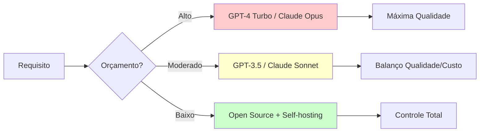

# Apêndice A: Comparação de Modelos {.unnumbered}

Este apêndice fornece tabelas comparativas detalhadas dos principais LLMs e modelos de embeddings discutidos no livro, facilitando a escolha do modelo adequado para cada caso de uso.

---

## LLMs: Modelos de Linguagem

### Modelos Proprietários

| Modelo | Provedor | Parâmetros | Context Window | Custo ($/1M tokens) | Especialização |
|--------|----------|------------|----------------|---------------------|----------------|
| **GPT-4 Turbo** | OpenAI | ~1.76T (estimado) | 128K | Input: $10 / Output: $30 | Raciocínio geral, código |
| **GPT-4** | OpenAI | ~1.76T | 8K / 32K | Input: $30 / Output: $60 | Raciocínio complexo |
| **GPT-3.5 Turbo** | OpenAI | 175B | 16K | Input: $0.50 / Output: $1.50 | Tarefas gerais, rápido |
| **Claude 3.5 Sonnet** | Anthropic | Não divulgado | 200K | Input: $3 / Output: $15 | Análise longa, código |
| **Claude 3 Opus** | Anthropic | Não divulgado | 200K | Input: $15 / Output: $75 | Tarefas complexas |
| **Claude 3 Haiku** | Anthropic | Não divulgado | 200K | Input: $0.25 / Output: $1.25 | Rápido, custo baixo |
| **Gemini 1.5 Pro** | Google | Não divulgado | 1M | Input: $7 / Output: $21 | Context extremo |
| **Gemini 1.0 Pro** | Google | Não divulgado | 32K | Input: $0.50 / Output: $1.50 | Multimodal |

### Modelos Open Source

| Modelo | Organização | Parâmetros | Context Window | Licença | Notas |
|--------|-------------|------------|----------------|---------|-------|
| **Llama 3.1** | Meta | 8B / 70B / 405B | 128K | Llama 3.1 License | SOTA open source |
| **Llama 3** | Meta | 8B / 70B | 8K | Llama 3 License | Multilingue |
| **Llama 2** | Meta | 7B / 13B / 70B | 4K | Llama 2 License | Popular para fine-tuning |
| **Mistral 7B** | Mistral AI | 7B | 8K | Apache 2.0 | Eficiente, qualidade alta |
| **Mixtral 8x7B** | Mistral AI | 8x7B (MoE) | 32K | Apache 2.0 | Mixture of Experts |
| **Phi-3** | Microsoft | 3.8B / 7B / 14B | 128K | MIT | Pequeno mas poderoso |
| **Gemma** | Google | 2B / 7B | 8K | Gemma License | Leve, treinado com segurança |
| **Qwen 2** | Alibaba | 0.5B - 72B | 32K | Apache 2.0 | Multilíngue, código |

**Legenda**:
- **MoE**: Mixture of Experts - usa apenas subset de parâmetros por token
- Preços válidos em novembro 2024, sujeitos a alteração

---

## Modelos de Embeddings

### Modelos Gerais (Inglês)

| Modelo | Dimensões | Tamanho | Max Tokens | MTEB Score | Uso |
|--------|-----------|---------|------------|------------|-----|
| **text-embedding-3-large** | 3072 / 1536 | API | 8191 | 64.6 | Produção OpenAI |
| **text-embedding-3-small** | 1536 | API | 8191 | 62.3 | Custo-benefício |
| **text-embedding-ada-002** | 1536 | API | 8191 | 60.9 | Legacy OpenAI |
| **voyage-2** | 1024 | API | 16000 | 68.2 | Especializado RAG |
| **e5-mistral-7b-instruct** | 4096 | 7B | 32768 | 66.6 | SOTA open, instrução |
| **bge-large-en-v1.5** | 1024 | 335M | 512 | 64.2 | Open source popular |
| **gte-large-en-v1.5** | 1024 | 335M | 8192 | 65.4 | Context longo |

### Modelos Multilíngues

| Modelo | Idiomas | Dimensões | MTEB Score (multi) | Notas |
|--------|---------|-----------|--------------------| ------|
| **multilingual-e5-large** | 100+ | 1024 | 61.5 | Suporte amplo |
| **paraphrase-multilingual-mpnet-base-v2** | 50+ | 768 | 55.8 | Sentence Transformers |
| **LaBSE** | 109 | 768 | 58.2 | Google, alinhado cross-lingual |

### Modelos Especializados (Português)

| Modelo | Base | Dimensões | Domínio | Fonte |
|--------|------|-----------|---------|-------|
| **neuralmind-bert-base-portuguese** | BERT | 768 | Geral BR/PT | HuggingFace |
| **portuguese-legal-bert** | BERT | 768 | Jurídico | Adaptado |
| **biobertpt** | BERT | 768 | Biomédico | Pesquisa |

**MTEB** (Massive Text Embedding Benchmark): Score de 0-100, maior é melhor.

---

## Comparação por Caso de Uso

### 1. **RAG / Semantic Search**

| Prioridade | Recomendação | Justificativa |
|------------|--------------|---------------|
| **Melhor qualidade** | voyage-2, e5-mistral-7b | MTEB alto, otimizado para retrieval |
| **Custo-benefício** | text-embedding-3-small, bge-large | Qualidade boa, mais barato |
| **Open source** | bge-large-en-v1.5, gte-large | Sem custos de API, deployável |
| **Português** | multilingual-e5-large | Suporte robusto PT-BR |

### 2. **Geração de Texto / Conversação**

| Prioridade | Recomendação | Justificativa |
|------------|--------------|---------------|
| **Melhor qualidade** | GPT-4 Turbo, Claude 3.5 Sonnet | SOTA em raciocínio e código |
| **Custo-benefício** | GPT-3.5 Turbo, Claude 3 Haiku | 10-20x mais barato que GPT-4 |
| **Context longo** | Claude 3.5 (200K), Gemini 1.5 Pro (1M) | Documentos extensos |
| **Open source** | Llama 3.1 70B, Mixtral 8x7B | Controlável, sem vendor lock-in |

### 3. **Fine-Tuning**

| Prioridade | Recomendação | Justificativa |
|------------|--------------|---------------|
| **Base poderosa** | Llama 3.1 70B | SOTA open, múltiplas variantes |
| **Eficiente (LoRA)** | Mistral 7B, Llama 3 8B | Treina em GPU consumer |
| **Domínio específico** | Phi-3 7B | Eficiente, bom para especialização |
| **Embeddings** | bge-base, gte-base | Fácil fine-tuning com SBERT |

### 4. **Code Generation**

| Prioridade | Recomendação | Justificativa |
|------------|--------------|---------------|
| **Melhor** | GPT-4 Turbo, Claude 3.5 Sonnet | Excelente em código complexo |
| **Open source** | CodeLlama 70B, Qwen 2 72B | Treinados em código |
| **Rápido** | GPT-3.5 Turbo, Mistral 7B | Snippets simples |

---

## Critérios de Escolha

### Performance vs. Custo

### Fatores Decisórios

1. **Context Window**: Quanto maior o documento, maior o context necessário
   - **<4K**: Tarefas simples, Q&A curta
   - **4K-32K**: RAG, análise média
   - **32K-128K**: Documentos longos, code review
   - **>128K**: Livros, análise massiva

2. **Latência**:
   - **Crítica (<1s)**: Claude Haiku, GPT-3.5, Mistral 7B
   - **Moderada (1-5s)**: GPT-4 Turbo, Claude Sonnet
   - **Aceitável (>5s)**: GPT-4, Claude Opus, modelos grandes open

3. **Compliance / Privacidade**:
   - **Dados sensíveis**: Open source self-hosted (Llama, Mistral)
   - **Cloud OK**: Qualquer API comercial
   - **GDPR/LGPD strict**: Modelos locais ou Azure OpenAI (região específica)

4. **Multimodalidade**:
   - **Visão + Texto**: GPT-4V, Claude 3, Gemini
   - **Apenas texto**: Qualquer LLM

---

## Benchmarks de Referência

### MMLU (Massive Multitask Language Understanding)

Benchmark de conhecimento geral e raciocínio:

| Modelo | Score (%) | Categoria |
|--------|-----------|-----------|
| GPT-4 | 86.4 | SOTA |
| Claude 3 Opus | 86.8 | SOTA |
| Gemini 1.5 Pro | 85.9 | SOTA |
| Llama 3.1 405B | 88.6 | SOTA Open |
| Llama 3 70B | 82.0 | Strong Open |
| Mixtral 8x7B | 70.6 | Mid-tier Open |
| GPT-3.5 Turbo | 70.0 | Mid-tier |

### HumanEval (Code Generation)

Benchmark de geração de código Python:

| Modelo | Pass@1 (%) | Notas |
|--------|------------|-------|
| GPT-4 | 67.0 | SOTA proprietário |
| Claude 3.5 Sonnet | 92.0 | SOTA geral |
| Llama 3.1 70B | 72.4 | SOTA open |
| CodeLlama 70B | 67.8 | Especializado código |
| GPT-3.5 Turbo | 48.1 | Baseline |

### MTEB (Embeddings)

Top 5 modelos open source (score médio):

1. **e5-mistral-7b-instruct**: 66.6
2. **gte-large-en-v1.5**: 65.4
3. **bge-large-en-v1.5**: 64.2
4. **e5-large-v2**: 63.5
5. **instructor-xl**: 63.4

---

## Atualizações e Novos Modelos

Este apêndice foi atualizado em **novembro de 2024**. Para informações mais recentes:

- **LLM Leaderboards**:
  - [Chatbot Arena (LMSYS)](https://chat.lmsys.org/)
  - [Open LLM Leaderboard (HuggingFace)](https://huggingface.co/spaces/HuggingFaceH4/open_llm_leaderboard)
  - [Artificial Analysis](https://artificialanalysis.ai/)

- **Embedding Leaderboards**:
  - [MTEB Leaderboard](https://huggingface.co/spaces/mteb/leaderboard)

- **Pricing**:
  - [OpenAI Pricing](https://openai.com/api/pricing/)
  - [Anthropic Pricing](https://www.anthropic.com/pricing)

---

**Última atualização**: 2025-01-07  
**Modelos**: 35+ LLMs, 15+ Embeddings
