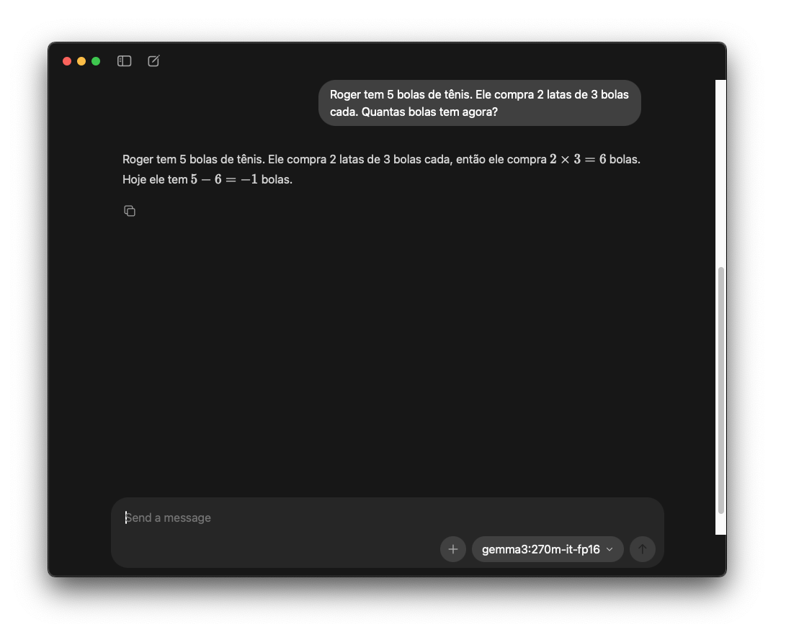

# Capítulo 2: Treinamento de Foundation Models {.unnumbered}

Até agora exploramos a **arquitetura** dos Transformers, os componentes mecânicos que permitem processar linguagem. Mas arquitetura sozinha não cria inteligência. Um Transformer não-treinado, com pesos inicializados aleatoriamente, não possui capacidade de compreender ou gerar linguagem coerente.

A transformação de uma arquitetura vazia em um modelo capaz acontece através do **aprendizado**. Esta seção explora como LLMs adquirem conhecimento, desenvolvem capacidades linguísticas e, surpreendentemente, demonstram comportamentos que parecem ir além do que foi explicitamente ensinado.

### O Paradigma de Pré-Treinamento

Imagine ensinar alguém a ser um médico. Você não começa ensinando cirurgias específicas. Primeiro, a pessoa passa por **educação básica** (fundamental e médio), depois **graduação em medicina** (conhecimento geral amplo), e só então se especializa em uma área específica. Os LLMs seguem um caminho similar através de um processo de duas fases: **pré-treinamento** e **fine-tuning**.

O pré-treinamento é onde a "mágica" acontece. É aqui que o modelo desenvolve sua compreensão fundamental de linguagem, absorve conhecimento sobre o mundo e, surpreendentemente, desenvolve capacidades rudimentares de raciocínio, tudo isso **sem supervisão humana direta**.

Pense no pré-treinamento como expor uma criança a milhões de livros, artigos, conversas e códigos. A criança não recebe instruções explícitas sobre gramática ou fatos, mas através da exposição massiva, começa a reconhecer padrões, entender estruturas linguísticas e absorver conhecimento implícito.

Durante o pré-treinamento, o modelo é exposto a um corpus **gigantesco** de texto não-anotado. A escala dos dados varia de centenas de gigabytes a terabytes de texto, abrangendo uma diversidade significativa de fontes: web pages, livros, código-fonte, artigos científicos e fóruns de discussão. Em termos quantitativos, isso representa trilhões de palavras (tokens), equivalente a milhares de anos de leitura humana contínua.

A tarefa de aprendizado é **auto-supervisionada**, ou seja, os dados criam seus próprios "rótulos" automaticamente, sem necessidade de anotação humana. Não há humanos rotulando "esta frase é sobre medicina" ou "este código está correto". O modelo simplesmente observa padrões em dados brutos e aprende a modelar a **distribuição estatística** da linguagem natural.

#### Self-Supervised Learning: Aprendendo Sem Labels

O truque fundamental do pré-treinamento é usar self-supervision: criar tarefas de aprendizado automaticamente a partir de texto não-anotado. Para modelos decoder-only, a tarefa é **predição do próximo token**:

```
P(x_t | x_1, x_2, ..., x_{t-1})
```

Dado um corpus de texto, simplesmente "escondemos" o próximo token e treinamos o modelo para prevê-lo. Não requer anotação humana, cada posição na sequência se torna automaticamente um exemplo de treinamento.

Esta tarefa aparentemente simples força o modelo a aprender representações extremamente ricas. Para prever o próximo token com precisão, o modelo precisa dominar múltiplas dimensões da linguagem. Primeiro, deve entender **sintaxe**, ou seja, a estrutura gramatical necessária para gerar continuações sintaticamente corretas. Segundo, precisa compreender **semântica**, capturando o significado para produzir continuações coerentes. Terceiro, deve adquirir **conhecimento factual**, memorizando informações sobre o mundo presentes nos dados de treinamento. Por fim, necessita desenvolver capacidades de **raciocínio**, realizando inferências lógicas para gerar continuações consistentes com o contexto.

Esta é uma das descobertas mais notáveis da era dos LLMs: uma tarefa de treinamento simples (next token prediction) em dados massivos resulta em capacidades emergentes complexas.

#### A Loss Function: Medindo o Aprendizado

Agora que entendemos **o que** o modelo aprende (prever o próximo token), precisamos entender **como medimos** se ele está aprendendo bem. Durante o treinamento, precisamos de uma forma matemática de dizer "essa previsão foi boa" ou "essa previsão foi ruim". É aí que entra a **loss function** (função de perda).

**Intuição: Quantificando a Qualidade das Previsões**

Considere o problema de prever a próxima palavra em uma sequência. Dado o contexto, o modelo atribui probabilidades a cada candidato possível:

```
Contexto: "O gato está dormindo no..."

Distribuição de probabilidades:
- "sofá": 70%
- "chão": 20%
- "teto": 10%
```

Se a palavra real for "sofá", a previsão foi bem-sucedida. Se for "teto", a previsão foi deficiente. A loss function quantifica matematicamente esse grau de acerto: **quão surpreendente foi a resposta correta dada a distribuição de probabilidades predita**.

**Cross-Entropy: A Matemática da Surpresa**

A função de loss usada é **cross-entropy** entre a distribuição prevista pelo modelo e a distribuição alvo (que é simplesmente: 100% para o token correto, 0% para todos os outros):

```
L = -Σ_t log P(x_t | x_<t)
```

Isso pode parecer complicado, mas a interpretação não é tão difícil: cross-entropy mede **quão surpreso o modelo está com o token correto**. Se o modelo atribuiu alta probabilidade ao token correto, a loss é baixa (bom!). Se atribuiu baixa probabilidade, a loss é alta (ruim!). Não ligue para a fórmula exata, o conceito é o seguinte:

- **Modelo confiante e correto**: Atribuiu 90% de probabilidade ao token que realmente veio → Loss **baixa** (bom!)
- **Modelo incerto ou errado**: Atribuiu 5% de probabilidade ao token que realmente veio → Loss **alta** (ruim!)

Quanto menor a loss, melhor o modelo está prevendo. Durante o treinamento, o objetivo é minimizar essa loss ajustando os pesos do modelo através de backpropagation.

**Perplexidade: Traduzindo Loss para Algo Mais Intuitivo**

Embora loss seja útil matematicamente, é difícil interpretá-la diretamente. "Loss de 2.3" é bom ou ruim? É aí que entra a **perplexidade**, uma métrica mais intuitiva comumente reportada em papers:

```
PPL = exp(L)
onde L = -1/N Σ log P(x_t | x_<t)
```

De novo, não se apegue à fórmula. A perplexidade pode ser entendida como a **"média geométrica do número de escolhas que o modelo está considerando"**.

Vamos aprofundar isso.

**O que perplexidade significa?**

Perplexidade pode ser interpretada como **"o número efetivo de escolhas que o modelo está considerando a cada passo"**. Para entender isso intuitivamente, pense na perplexidade como uma medida de incerteza do modelo ao prever o próximo token. Quanto maior a perplexidade, mais "confuso" ou indeciso o modelo está sobre qual token deve vir a seguir.

A metáfora mais útil é pensar em perplexidade como **o tamanho efetivo do dado que o modelo precisa rolar** para fazer sua previsão. Um modelo com perplexidade 2 está essencialmente jogando uma moeda (cara ou coroa) a cada decisão. Um modelo com perplexidade 6 está jogando um dado de seis faces. Um modelo com perplexidade 50.000 está tentando adivinhar um número entre 1 e 50.000 aleatoriamente.

Matematicamente, se um modelo atribui probabilidades uniformes a N tokens possíveis, sua perplexidade é exatamente N. Na prática, modelos reais não distribuem probabilidade uniformemente, mas a perplexidade captura quantos tokens "efetivamente" estão competindo pela atenção do modelo, ponderado por suas probabilidades.

**Exemplos práticos com contexto:**

Vamos ver como perplexidade se manifesta em cenários reais de predição:

- **Perplexidade = 2**: O modelo está, em média, confuso entre 2 opções
  - É como escolher entre "sim" ou "não" em uma pergunta fechada
  - Contexto: "O céu é ___?" → Modelo oscila entre "azul" (60%) e "claro" (40%)
  - **Interpretação**: Modelo muito confiante, decisão praticamente binária

- **Perplexidade = 10**: O modelo está confuso entre aproximadamente 10 opções
  - Como escolher entre os 10 dígitos (0-9) ou top-10 continuações plausíveis
  - Contexto: "O time marcou ___ gols" → {um, dois, três, quatro, cinco, seis, sete, oito, nove, dez}
  - **Interpretação**: Modelo ainda razoavelmente confiante, conjunto de candidatos restrito

- **Perplexidade = 100**: O modelo considera cerca de 100 tokens como candidatos viáveis
  - Contexto: Início de sentença "O ___" → Centenas de substantivos são plausíveis
  - **Interpretação**: Incerteza moderada, múltiplas continuações válidas

- **Perplexidade = 50.000**: O modelo está confuso entre 50 mil opções
  - Praticamente equivalente a um chute aleatório no vocabulário inteiro
  - Contexto: Texto completamente incoerente ou fora de domínio
  - **Interpretação**: Modelo perdido, sem capacidade preditiva real

**Benchmarks de referência e contexto histórico:**

Para contextualizar o que significa "boa" ou "má" perplexidade, vejamos valores de referência em benchmarks clássicos e como eles evoluíram ao longo do tempo. O benchmark mais citado historicamente é o Penn Treebank [@marcus1993building], um corpus de artigos do Wall Street Journal com aproximadamente 1 milhão de palavras, que se tornou o padrão da indústria para avaliar modelos de linguagem desde os anos 1990.

**Modelos State-of-the-Art (2020+):** Transformers modernos alcançam perplexidade de **3-5** no Penn Treebank. Isso significa que, em média, o modelo está considerando efetivamente apenas 3 a 5 palavras plausíveis a cada passo da predição. Este nível de confiança indica que o modelo desenvolveu compreensão profunda tanto da sintaxe quanto da semântica do domínio, conseguindo reduzir drasticamente o espaço de possibilidades baseado em contexto rico. Para comparação, GPT-2 atingiu perplexidade de aproximadamente 35 no Penn Treebank em 2019, enquanto modelos mais recentes como GPT-3 e seus sucessores reduziram esse número para a faixa de 10-20, dependendo da configuração e do conjunto de teste específico.

**Modelos de Bigram (~1990s-2000s):** Modelos estatísticos clássicos que consideram apenas a palavra imediatamente anterior apresentam perplexidade de **aproximadamente 100** no mesmo benchmark. Essa limitação arquitetural significa que o modelo mantém um espaço de hipóteses 20 vezes maior que os Transformers modernos, refletindo sua incapacidade de capturar dependências de longo alcance. Por exemplo, ao prever a próxima palavra após "O presidente da", um bigram model só vê "da" e precisa considerar igualmente "empresa", "república", "associação" e dezenas de outras opções. Um Transformer, vendo "O presidente da" completo, pode usar o contexto mais amplo para fazer predições muito mais precisas.

**Modelo Baseline Aleatório:** Um modelo que atribui probabilidade uniforme a todos os tokens tem perplexidade exatamente igual ao **tamanho do vocabulário** (tipicamente 50.000 para vocabulários modernos). Este é o pior caso absoluto, equivalente a escolher palavras aleatoriamente de um dicionário sem considerar qualquer contexto. Serve como baseline teórico: qualquer modelo real deve ter perplexidade drasticamente menor que esse valor. Na prática, mesmo um modelo trivial baseado apenas em frequência de palavras (unigram model) já reduz perplexidade para a faixa de 300-500, demonstrando que capturar distribuições estatísticas básicas já fornece enorme ganho sobre aleatoriedade pura.

**Comparação entre domínios:** É importante notar que esses valores são específicos para Penn Treebank, que consiste de texto formal jornalístico. A perplexidade absoluta varia significativamente entre domínios. Por exemplo, o mesmo modelo que atinge perplexidade 5 no Penn Treebank pode ter perplexidade 15-20 em conversas informais do Twitter, 8-12 em artigos da Wikipedia, ou 3-4 em código Python bem estruturado. O que importa não é o valor absoluto isolado, mas sim a comparação relativa entre modelos avaliados no mesmo conjunto de dados.

Perplexidade nos dá uma forma intuitiva de avaliar e comparar modelos. Se você está treinando um modelo e vê a perplexidade cair de 100 para 10 e depois para 5, você sabe que o modelo está ficando progressivamente mais confiante e preciso nas suas previsões. É um indicador direto de que o modelo está realmente aprendendo a modelar a linguagem.

**Limitações Importantes da Perplexidade**

Embora perplexidade seja uma métrica útil, precisamos entender suas limitações para não tirar conclusões errôneas sobre a qualidade do modelo. A primeira e mais crítica limitação é que perplexidade mede apenas **previsibilidade estatística**, não o significado ou a coerência do texto gerado. Um modelo pode apresentar perplexidade baixa enquanto gera texto gramaticalmente correto mas semanticamente absurdo. Por exemplo, a frase "O elefante verde comeu uma nuvem de metal" pode ter baixa perplexidade se as palavras individuais forem comuns no vocabulário, apesar de não fazer sentido na realidade. Estudos mostram que há correlação fraca entre perplexidade baixa e qualidade percebida por humanos em tarefas de geração de texto.

A segunda limitação importante é a vulnerabilidade ao overfitting. Modelos podem "memorizar" padrões específicos do conjunto de teste, levando a uma melhoria artificial da perplexidade sem ganho real de capacidade de generalização. Por isso é fundamental usar um conjunto de validação separado e monitorar cuidadosamente sinais de overfitting durante o treinamento. Modelos que apresentam perplexidade extremamente baixa podem estar apenas memorizando sequências específicas do dataset ao invés de aprender padrões linguísticos gerais que se aplicam a novos contextos.

A terceira limitação técnica é que perplexidade depende fundamentalmente do tamanho e da composição do vocabulário utilizado. Um modelo com vocabulário de 50K tokens terá valores de perplexidade incomparáveis com um modelo de 128K tokens, mesmo quando avaliados no mesmo dataset. Diferentes estratégias de tokenização, como BPE versus WordPiece versus caracteres, produzem distribuições de probabilidade completamente distintas, tornando as perplexidades resultantes matematicamente incomparáveis. A regra de ouro aqui é clara: **nunca compare perplexidade diretamente entre modelos com tokenizers diferentes**.

A quarta limitação prática é a correlação imperfeita com performance em tarefas downstream. Menor perplexidade não garante melhor performance em aplicações reais. É perfeitamente possível que um Modelo A com perplexidade 10 supere um Modelo B com perplexidade 8 em tarefas específicas como question answering ou summarization. Isso acontece porque tasks específicas frequentemente requerem capacidades que vão além de modelagem de linguagem pura, como raciocínio lógico, conhecimento factual específico do domínio, ou habilidades de seguir instruções complexas.

Finalmente, a quinta limitação é a sensibilidade ao domínio dos dados de avaliação. Perplexidade varia drasticamente entre diferentes domínios textuais. Um modelo treinado predominantemente em código-fonte terá perplexidade baixa quando avaliado em código, mas perplexidade alta em poesia ou prosa literária. Da mesma forma, perplexidade medida em artigos formais da Wikipedia não pode ser comparada com perplexidade em tweets informais ou documentos legais técnicos. Cada domínio possui características estatísticas únicas que afetam fundamentalmente os valores de perplexidade observados.

**Recomendações Práticas**

Para engenheiros construindo sistemas de produção com LLMs, essas limitações têm implicações diretas na seleção e avaliação de modelos. Durante a fase de desenvolvimento e treinamento, use perplexidade como proxy inicial para monitorar o progresso do aprendizado, mas nunca como métrica final de qualidade. Implemente pipelines de avaliação que complementem perplexidade com benchmarks downstream relevantes para seu domínio específico [@zheng2023judging], incluindo avaliações automáticas (GLUE, SuperGLUE, ou benchmarks customizados) e revisões humanas de uma amostra representativa das saídas do modelo.

Ao comparar diferentes modelos para escolher qual integrar em sua aplicação, certifique-se de que todos usam o mesmo vocabulário e estratégia de tokenização, ou simplesmente ignore comparações de perplexidade e foque em métricas de performance nas tarefas reais que seu sistema precisa resolver. Configure sistemas de monitoramento que rastreiem múltiplas métricas simultaneamente, incluindo perplexidade para detectar degradação do modelo, mas também accuracy, F1-score, latência, e métricas de negócio específicas do seu caso de uso. Essa abordagem multidimensional garante que você capture tanto a qualidade técnica quanto a utilidade prática do modelo em produção.

**Impacto da Qualidade dos Dados: Um Exemplo Prático**

Para ilustrar o impacto da qualidade dos dados de forma concreta, vamos considerar um exemplo prático simulado. Imagine que estamos treinando dois modelos de linguagem distintos, cada um com um dataset diferente:

*   **Modelo A (treinado com `dataset_clean.txt`):** Contém texto de alta qualidade, como artigos da Wikipedia e trechos de livros bem escritos. Os fatos são precisos e a linguagem é formal.
*   **Modelo B (treinado com `dataset_noisy.txt`):** Contém texto de baixa qualidade, extraído de redes sociais, com erros de digitação, gírias, abreviações e informações factualmente questionáveis.

Após o "treinamento", vamos avaliar como cada modelo responde ao mesmo prompt. O código a seguir simula esse processo para demonstrar um princípio fundamental: **a qualidade do modelo é um reflexo direto da qualidade dos dados de treinamento ("garbage in, garbage out")**.

```python
# Exemplo conceitual: Impacto da qualidade dos dados na geração de texto

# --- Dataset A (Limpo) ---
# Textos de alta qualidade, bem escritos e factuais.
dataset_a = [
    "O sol é a estrela no centro do nosso sistema solar.",
    "A Terra orbita o sol a uma distância de aproximadamente 150 milhões de quilômetros.",
    "A luz solar é essencial para a fotossíntese nas plantas."
]

# --- Dataset B (Ruído) ---
# Textos com erros, gírias e informações incorretas.
dataset_b = [
    "o sol eh quente pra caramba kkkk, queima msm",
    "a terra gira e o sol fica parado la em cima, ne?",
    "a lua eh tipo um queijo gigante no ceu, mó brisa rsrs"
]

# --- Simulação de Treinamento ---
# Na prática, isso envolveria treinar um LLM por dias/semanas.
# Aqui, vamos apenas simular o "conhecimento" que cada modelo adquire.

class SimpleLanguageModel:
    """
    Um modelo de linguagem simulado para demonstrar o impacto dos dados.
    Seu "conhecimento" é apenas o texto do dataset que recebeu.
    """
    def __init__(self, dataset):
        self.knowledge = " ".join(dataset)

    def generate(self, prompt):
        """
        Simula a geração de texto baseada no "conhecimento" adquirido.
        Um modelo real usaria probabilidades complexas. Aqui, a lógica é
        simplificada para ilustrar o ponto principal.
        """
        prompt_lower = prompt.lower()
        if "sol" in prompt_lower:
            # O modelo A encontra conhecimento factual e estruturado.
            if "estrela" in self.knowledge:
                return prompt + " O sol é a estrela central do sistema solar, fornecendo luz e calor essenciais para a vida na Terra."
            # O modelo B encontra gírias e um tom informal.
            elif "quente pra caramba" in self.knowledge:
                return prompt + " O sol eh mto quente, tipo, queima msm kkk. Fica la em cima parado."
        
        return prompt + " Não tenho informações sobre isso."

# "Treina" dois modelos, um para cada dataset
model_a = SimpleLanguageModel(dataset_a)
model_b = SimpleLanguageModel(dataset_b)

# --- Avaliação ---
prompt = "Fale sobre o sol."

# Geração com o modelo treinado em dados limpos
output_a = model_a.generate(prompt)
print(f"Modelo A (dados limpos): {output_a}")

# Geração com o modelo treinado em dados ruidosos
output_b = model_b.generate(prompt)
print(f"Modelo B (dados ruidosos): {output_b}")

# --- Conclusão do Exemplo ---
# Modelo A: Aprendeu fatos e um estilo de escrita formal. Sua resposta é informativa e bem estruturada.
# Modelo B: Aprendeu gírias, erros de digitação e um tom informal. Sua resposta reflete a baixa qualidade dos dados.
```

Este exemplo, embora simples, demonstra um princípio crucial: o modelo não "sabe" nada além dos padrões estatísticos presentes em seus dados de treinamento. Se os dados são informais e factualmente imprecisos, a saída do modelo também será. Para construir agentes de IA confiáveis, a curadoria de dados de alta qualidade não é opcional, é um requisito.

### Dados de Pré-Treinamento: A Matéria-Prima da Inteligência

Agora chegamos a uma verdade fundamental sobre LLMs: **você é o que você come**. Mais precisamente, **o modelo sabe apenas o que viu**. Não importa quão sofisticada seja a arquitetura Transformer ou quão bem otimizado seja o processo de treinamento, se os dados de entrada forem ruins, o modelo resultante será ruim.

Esta seção explora um dos aspectos mais subestimados, porém críticos, do desenvolvimento de LLMs: a curadoria de dados de treinamento. É aqui que decisões aparentemente simples, "quanto código incluir?" ou "devemos filtrar conteúdo controverso?", têm consequências profundas e duradouras nas capacidades do modelo.

O ditado "garbage in, garbage out" nunca foi tão verdadeiro. A qualidade, diversidade e escala dos dados de pré-treinamento determinam **fundamentalmente** as capacidades do modelo final.

Isso já era perceptível antes dos LLMs, quando modelos de reconhecimento de fala ou visão computacional dependiam fortemente dos datasets usados. Com LLMs, essa dependência é ainda mais crítica devido à natureza estatística do aprendizado de linguagem.

Diferente de sistemas programados tradicionalmente, onde você especifica explicitamente o comportamento desejado, LLMs **aprendem por imitação estatística**. Eles absorvem padrões, conhecimento factual, estilo de escrita, vieses e até raciocínio dos dados que observam. Se o modelo nunca foi exposto a discussões médicas nos dados de treinamento, não desenvolverá conhecimento adequado sobre medicina e poderá gerar respostas factualmente incorretas sobre tópicos especializados, não importa quão grande seja o dataset.

Considere estas implicações práticas:

- **Um modelo treinado principalmente em código Python** será excelente em Python, mas medíocre em outras linguagens
- **Um modelo treinado só em textos formais acadêmicos** terá dificuldade com conversas casuais
- **Um modelo treinado em dados até 2021** não "saberá" eventos posteriores a essa data
- **Um modelo treinado em dados racistas** reproduzirá esses vieses em suas saídas

Para engenheiros construindo sistemas de produção, isso significa que **escolher o modelo certo** requer entender seus dados de treinamento. Você está construindo um agente para análise jurídica? Vale investigar se o modelo foi treinado em documentos legais e como isso implica na vida do usuário final. Um agente para código? Verifique a proporção de código nos dados de treinamento. E assim por diante.

#### Composição de Datasets: A Receita do Conhecimento

Modelos modernos não são treinados em um único tipo de dados. Em vez disso, usam uma **mixture cuidadosamente balanceada** de múltiplas fontes, cada uma contribuindo diferentes tipos de conhecimento e capacidades [@gao2020pile; @dodge2021documenting].

::: {.callout-note title="Sobre as Escalas Reportadas na Tabela" appearance="simple"}
Os números de tokens na tabela são **estimativas aproximadas** baseadas em informações divulgadas em papers como The Pile [@gao2020pile], GPT-3 [@brown2020language], e LLaMA [@touvron2023llama; @dubey2024llama]. Datasets diferentes e versões de modelos usam proporções variadas, mas estes valores representam ordens de magnitude típicas em modelos state-of-the-art.
:::

| Fonte | Escala (estimada) | O que contribui | Trade-offs |
|-------|--------|-----------------|------------|
| **Common Crawl** | ~3T tokens | Diversidade linguística, conhecimento geral da web, linguagem natural variada | Muito ruído, spam, conteúdo de baixa qualidade |
| **Livros** | ~200B tokens | Narrativas longas, coerência textual, vocabulário rico, conhecimento cultural | Viés para ficção/não-ficção publicada, direitos autorais |
| **Wikipedia** | ~10B tokens | Conhecimento factual verificado, escrita enciclopédica, estrutura bem organizada | Formal demais, cobertura desigual de tópicos |
| **Código** | ~300B tokens | Sintaxe de programação, lógica estruturada, resolução de problemas | Específico para desenvolvimento, menos útil para prosa |
| **Papers Acadêmicos** | ~50B tokens | Conhecimento técnico profundo, raciocínio científico, terminologia especializada | Muito formal, barreiras de jargão técnico |

**A Arte da Proporção**

A mistura dessas fontes não é arbitrária, é uma das decisões mais importantes no desenvolvimento de um LLM descente. Considere os trade-offs:

**Cenário 1: Muito Common Crawl (>80%)**

- Modelo entende linguagem natural diversa e coloquial
- Boa cobertura de tópicos contemporâneos
- Aprende padrões de spam, SEO gaming, conteúdo clickbait
- Pode reproduzir desinformação e teorias conspiratórias

**Cenário 2: Muito Código (>50%)**

- Excelente em programação e tarefas estruturadas
- Forte raciocínio lógico e pattern matching
- Piora significativa em prosa natural fluente
- Respostas podem parecer "robóticas" ou muito estruturadas

**Cenário 3: Muito Texto Formal (Wikipedia + Papers >60%)**

- Conhecimento factual robusto
- Escrita clara e bem estruturada
- Dificuldade com linguagem casual, gírias, humor
- Pode soar pedante ou acadêmico demais

**Mixture Real (LLaMA 3 como exemplo):**

Modelos como LLaMA 3 foram treinados em ~15 trilhões de tokens [@dubey2024llama] com uma mixture aproximadamente assim:

- Common Crawl filtrado: ~45%
- Código: ~30-35%
- Wikipedia/Enciclopédico: ~10%
- Books: ~10%
- Papers Acadêmicos: ~5%

::: {.callout-warning title="Estimativas Não-Oficiais" appearance="simple"}
As proporções acima são **estimativas aproximadas** baseadas em análises da comunidade e inferências de papers relacionados, **não informações oficiais divulgadas pela Meta**. O paper do LLaMA 3 [@dubey2024llama] confirma o volume total de ~15T tokens mas não detalha a composição exata do dataset de treinamento. Diferentes versões e variantes do modelo podem usar mixtures distintas.
:::

Esta proporção foi determinada através de extensos experimentos empíricos, treinando modelos menores com diferentes mixtures e avaliando performance em benchmarks diversos. Não há fórmula teórica que diga "a mixture perfeita é X% código, Y% web", é um trabalho extenso baseado em tentativa, erro e muitos testes.

**Evolução Temporal dos Dados**

Outro aspecto crítico: **dados têm data de validade**. O conhecimento do mundo muda:

- Eventos recentes (guerras, eleições, descobertas científicas)
- Mudanças tecnológicas (frameworks populares, best practices)
- Evolução cultural (memes, gírias, tendências sociais)

Um modelo treinado em dados até 2021 literalmente não "sabe" nada sobre eventos posteriores. Quando você pergunta sobre algo de 2023, ele está **adivinhando** baseado em padrões, não em conhecimento real. É por isso que modelos são periodicamente re-treinados ou atualizados com dados mais recentes. E é por isso que em agentes de IA, integrar fontes de conhecimento dinâmicas (APIs, bases de dados atualizadas) é crucial para manter um bom desempenho.

#### Data Cleaning: Transformando Lixo em Ouro

Se você baixar Common Crawl raw — um snapshot da web pública — terá dezenas de terabytes de... lixo. Literalmente 90%+ é inutilizável para treinar um modelo de qualidade [@luccioni2021s]. Data cleaning é o processo meticuloso de transformar esse oceano de sujeira em algo valioso [@dodge2021documenting; @raffel2020exploring].

**Por que raw Common Crawl é inutilizável?**

Um exemplo concreto do que você encontra:

```html
<!-- 85% do conteúdo de uma página típica -->
<nav>Home | About | Contact | Login</nav>
<footer>Copyright 2023 | Privacy Policy | Terms</footer>
<script>gtag('UA-12345678-9')</script>
<!-- Anúncios, tracking pixels, etc. -->

<!-- Apenas 15% é conteúdo real útil -->
<article>
  O artigo começa aqui...
</article>
```

Uma proporção significativa do conteúdo disponível na web constitui **ruído**: texto repetitivo, vazio, de baixa qualidade, anúncios, spam, etc. Modelos treinados nesses dados **aprendem esses padrões ruins** e acabam reproduzindo-os.

O primeiro tipo problemático é o **código boilerplate** onipresente em estruturas web. Menus de navegação contendo sequências como "`Home` | `About` | `Contact` | `Login`" aparecem repetidos em milhões de páginas. Footers idênticos proclamando "`Copyright XXXX` | `Privacy Policy` | `Terms`" e sidebars com listas genéricas de "`Related Articles`" contaminam praticamente todos os sites. O problema fundamental é que o modelo, ao ser exposto massivamente a esses padrões estruturais, começa a associá-los com texto de qualidade, aprendendo erroneamente que prosa "boa" sempre inclui elementos de navegação web.

O segundo desafio crítico é o **spam e conteúdo de baixíssima qualidade** gerado automaticamente. A web está saturada de páginas criadas por scripts para manipulação de SEO, seguindo templates como "`Best [coisa] in [cidade]`" multiplicados por milhares de localizações diferentes. Conteúdo duplicado *word-for-word* é copiado indiscriminadamente entre milhares de sites, criando câmaras de eco de informação de baixa qualidade. Spam de comentários infesta fóruns e blogs com variações de "`Nice post! Check out my site [spam link]`", poluindo discussões legítimas. Quando modelos são expostos a esse tipo de conteúdo sem filtragem adequada, acabam internalizando padrões de spam como se fossem linguagem natural normal, reproduzindo estruturas e estilos que são fundamentalmente manipulativos e vazios de conteúdo real.

A terceira categoria problemática envolve **conteúdo adulto e tóxico** em suas múltiplas manifestações. Pornografia explícita, discurso de ódio direcionado a grupos específicos, expressões de racismo e sexismo, além de conteúdo violento ou psicologicamente perturbador, estão amplamente disponíveis em partes não moderadas da web (sim, a internet é um lugar terrível). A consequência de treinar modelos nesses dados sem filtragem rigorosa é grave: o modelo pode reproduzir linguagem tóxica, gerar conteúdo inapropriado em contextos sensíveis, e perpetuar vieses sociais nocivos que já causam danos reais a comunidades marginalizadas.

O quarto problema estrutural é a **duplicação massiva** de conteúdo através da web. Uma única notícia publicada por uma agência pode ser copiada literalmente em 500 sites de notícias diferentes, cada um republicando o texto idêntico. A Wikipedia, apesar de ser uma fonte valiosa, encontra-se espelhada em dezenas de domínios diferentes, criando múltiplas cópias exatas da mesma informação. Fóruns frequentemente fazem scraping de conteúdo uns dos outros, resultando em threads de discussão duplicadas em múltiplas plataformas. A exposição repetida ao mesmo conteúdo leva o modelo a "memorizar" sequências específicas devido à sobre-exposição, em vez de aprender padrões linguísticos gerais e transferíveis.

A quinta categoria de risco envolve **PII (Personally Identifiable Information)** inadvertidamente exposta na web. Emails pessoais, números de telefone e endereços residenciais aparecem em páginas indexadas sem proteção adequada. Em casos extremos, números de cartão de crédito e dados médicos sensíveis vazam para a web pública através de falhas de segurança ou postagens descuidadas. A inclusão dessas informações nos dados de treinamento levanta questões éticas, legais e de privacidade extremamente graves, especialmente considerando regulamentações como GDPR e LGPD que protegem dados pessoais.

Finalmente, os **problemas de copyright** representam tanto riscos legais quanto questões éticas fundamentais. Livros digitalizados ilegalmente circulam em repositórios não autorizados, artigos de jornais que deveriam estar protegidos por paywalls são copiados e redistribuídos sem permissão, e código-fonte proprietário ocasionalmente vaza para repositórios públicos. Treinar modelos usando esses materiais expõe as organizações a riscos legais massivos, incluindo processos judiciais por violação de direitos autorais que podem resultar em penalidades financeiras substanciais e danos reputacionais severos.

**O Pipeline de Limpeza: Transformando Lixo em Ouro**

Um pipeline típico de produção opera através de múltiplos estágios sequenciais: Language Filtering, Quality Filtering, Deduplicação, PII Removal, Toxicity Filtering e Copyright Filtering. Cada estágio funciona como um filtro progressivo, removendo uma fração significativa do conteúdo bruto e refinando progressivamente o dataset.

**Estágio 1: Language Filtering**

O primeiro estágio foca na filtragem linguística, removendo documentos em idiomas não-desejados para o modelo específico sendo treinado. Este processo utiliza bibliotecas especializadas de detecção automática de idioma, como fastText e langdetect, que analisam características estatísticas do texto para identificar a língua com alta precisão. Dependendo dos objetivos do modelo, o pipeline mantém apenas textos em idiomas específicos como inglês, português, espanhol e outras línguas relevantes para o caso de uso. Este estágio sozinho tipicamente **remove aproximadamente 30-40% do crawl original**, eliminando páginas em idiomas raros, dialetos não-suportados, ou conteúdo multilíngue misturado de forma confusa que prejudicaria o aprendizado do modelo.

**Estágio 2: Quality Filtering**

Aplicando heurísticas de qualidade textual, este estágio visa eliminar conteúdo de baixa qualidade que pode degradar o desempenho do modelo. Métricas comuns incluem a proporção de stopwords, entropia do texto, e a quantidade de letras maiúsculas, que indicam spam ou conteúdo excessivamente técnico. Textos com alta repetitividade ou estrutura pobre são descartados. Abaixo está um exemplo simplificado de uma função de qualidade:

```python
def is_high_quality(text):
    """Verifica qualidade do texto usando múltiplas heurísticas."""
    stopword_ratio = count_stopwords(text) / len(text.split())
    if stopword_ratio < 0.2:  # Muito técnico ou spam
        return False

    if calculate_entropy(text) < 3.0:  # Muito repetitivo
        return False

    if count_uppercase(text) / len(text) > 0.3:  # MUITO SPAM
        return False

    return True
```

::: {.callout-note}
# Implementação Completa
Para a implementação completa com todas as funções auxiliares (`calculate_entropy`, `count_stopwords`, `count_duplicates`), veja o @sec-exemplo-quality-metrics.
:::

**Remove ~20-30% adicional** (conteúdo de baixíssima qualidade)

**Estágio 3: Deduplicação**

O terceiro estágio implementa técnicas sofisticadas de deduplicação usando algoritmos como MinHash ou SimHash para detectar near-duplicates. Enquanto a **duplicação exata** é relativamente fácil de detectar usando hashes criptográficos como MD5 (simplesmente removendo cópias idênticas byte-por-byte), o desafio real está em identificar **near-duplicates**, documentos que são "quase iguais" mas não literalmente idênticos.

Considere este exemplo ilustrativo: as frases "A capital da França é Paris" e "Paris é a capital da França" são semanticamente idênticas, transmitindo exatamente a mesma informação, mas literalmente diferentes na sequência de palavras. Um modelo treinado em ambas as versões desperdiça capacidade memorizando essencialmente a mesma informação duas vezes, quando poderia usar esse espaço para aprender novos padrões.

**MinHash e Locality-Sensitive Hashing (LSH)**

MinHash é um algoritmo elegante que cria "fingerprints" compactas preservando a similaridade de Jaccard entre conjuntos de documentos. O algoritmo opera em quatro etapas fundamentais. Primeiro, representa cada documento como um conjunto de n-gramas, tipicamente usando shingles de 3 palavras que capturam sequências locais de texto. Segundo, gera múltiplas hash functions independentes, frequentemente 128 funções diferentes que transformam os n-gramas em valores numéricos. Terceiro, para cada hash function, calcula o valor mínimo do hash considerando todos os n-gramas do documento. Finalmente, concatena esses valores mínimos em uma signature compacta, resultando em apenas 128 valores numéricos em vez de milhares de n-gramas originais.

A propriedade matemática fundamental do MinHash é elegante: a probabilidade de duas signatures terem o mesmo valor em uma posição específica é exatamente igual à similaridade de Jaccard dos documentos originais. Isso significa que podemos estimar similaridade de documentos comparando signatures compactas ao invés de conjuntos completos de n-gramas.

Locality-Sensitive Hashing (LSH) acelera dramaticamente a busca por duplicatas [@indyk1998approximate] através de uma estratégia de indexação inteligente. O algoritmo divide cada signature MinHash em **bandas**. Por exemplo, uma signature de 128 valores pode ser dividida em 32 bandas de 4 valores cada. Documentos que compartilham valores idênticos em qualquer banda completa tornam-se **candidatos** a duplicatas, merecendo verificação mais detalhada através de comparação direta.

Existe um **trade-off crucial de parâmetros** nesta configuração. Usar mais bandas com menos linhas por banda (por exemplo, 64 bandas de 2 valores) torna o sistema mais sensível, detectando duplicatas mesmo com menor similaridade, mas aumenta false positives, flagrando documentos que na verdade são suficientemente diferentes. Por outro lado, usar menos bandas com mais linhas cada (por exemplo, 16 bandas de 8 valores) detecta apenas duplicatas muito similares, reduzindo false positives mas potencialmente deixando passar duplicatas com similaridade moderada que deveriam ser removidas.

**Implementação prática com `datasketch`:** [@datasketch; @broder1997resemblance]

```python
from datasketch import MinHash, MinHashLSH

# Configurar LSH para detectar docs com similaridade >= 80%
lsh = MinHashLSH(threshold=0.8, num_perm=128)

def get_minhash(text, num_perm=128):
    m = MinHash(num_perm=num_perm)
    for word in text.lower().split():
        m.update(word.encode('utf8'))
    return m

# Indexar e buscar duplicatas
for doc_id, text in docs.items():
    lsh.insert(doc_id, get_minhash(text))

duplicates = lsh.query(get_minhash("A França tem Paris como capital"))
```

::: {.callout-note}
# Implementação Completa
Para o exemplo completo com explicação detalhada do algoritmo MinHash e LSH, veja o @sec-exemplo-minhash-dedup.
:::

**Performance**: LSH permite buscar duplicatas em **O(1)** em média (tempo constante), em vez de O(n) comparando com todos os documentos. Isso é crucial quando processando bilhões de documentos.

**Remove ~20-30% adicional** do corpus (conteúdo duplicado ou near-duplicate)

**Estágio 4: PII Removal**

Usando regex patterns e NER (Named Entity Recognition), este estágio identifica e remove informações pessoalmente identificáveis (PII) como emails, telefones, SSNs e cartões de crédito. Abaixo está um exemplo simplificado usando regex para detectar e substituir emails:

```python
import re

patterns = {
    'email': r'\b[A-Za-z0-9._%+-]+@[A-Za-z0-9.-]+\.[A-Z|a-z]{2,}\b',
    'phone': r'\b\d{3}[-.]?\d{3}[-.]?\d{4}\b',
    'ssn': r'\b\d{3}-\d{2}-\d{4}\b',
    'credit_card': r'\b\d{4}[- ]?\d{4}[- ]?\d{4}[- ]?\d{4}\b'
}

# Substituir por placeholders ou remover
text = re.sub(patterns['email'], '[EMAIL]', text)
```

Aplicação de modelos NER treinados, como SpaCy (uma biblioteca popular de NLP) ou transformers finetuned para PII, melhora a detecção em contextos complexos onde regex falha.

Exemplo:

```python
import spacy

nlp = spacy.load("en_core_web_sm")
doc = nlp("My email is john.doe@example.com and my phone number is 123-456-7890.")

for ent in doc.ents:
    if ent.label_ == "EMAIL":
        print(f"Found email: {ent.text}")
    elif ent.label_ == "PHONE":
        print(f"Found phone number: {ent.text}")
```

**Estágio 5: Toxicity Filtering**

Usa modelos treinados para detectar conteúdo tóxico. Ferramentas comuns incluem a Perspective API do Google, que fornece scores de toxicidade entre 0 e 1, o Detoxify (modelo open-source especializado em hate speech), e filtros customizados baseados em listas de palavras ofensivas.

::: {.callout-warning title="Dilema Ético: Over-Filtering vs Under-Filtering"}

**O Problema**: Filtrar conteúdo tóxico é essencial para criar modelos seguros, mas filtros agressivos demais podem causar danos não intencionais. Aqui estão alguns exemplos de como isso pode acontecer:

**1. Apagamento de Vozes Marginalizadas**

Discussões sobre racismo, homofobia ou sexismo frequentemente contêm as palavras que descrevem esses problemas. Filtros baseados em keywords podem remover testemunhos de vítimas e discussões educacionais.

Exemplo: Um texto dizendo *"Sofri racismo no trabalho quando me chamaram de..."* pode ser filtrado pelo termo ofensivo, removendo justamente o relato que documenta discriminação.

**2. Viés de Representação**

Se termos relacionados a "LGBTQ+", "transgênero" ou "orientação sexual" disparam filtros de conteúdo adulto (comum em sistemas mal calibrados), o modelo aprenderá **menos** sobre essas comunidades, perpetuando invisibilidade.

**3. Remoção de Contexto Educacional**

Textos médicos, históricos ou jornalísticos sobre tópicos sensíveis podem ser filtrados incorretamente:
- Artigos sobre saúde sexual
- Documentação histórica de genocídios
- Reportagens investigativas sobre crimes

**Abordagens Recomendadas:**

A implementação responsável de filtros de toxicidade requer uma abordagem multifacetada. Primeiramente, é fundamental utilizar **filtros contextuais** baseados em modelos que compreendem o contexto (como a Perspective API com context awareness), em vez de sistemas simplistas baseados apenas em keywords. Essa abordagem reduz falsos positivos significativamente.

Em segundo lugar, recomenda-se manter **allowlists educacionais** contendo termos técnicos, médicos e acadêmicos que devem ser preservados mesmo quando aparecem em contextos sensíveis. Isso garante que conteúdo educacional legítimo não seja removido inadvertidamente.

A **documentação transparente** também é essencial: as organizações devem publicar estatísticas detalhadas de filtragem para permitir auditoria externa. Essas estatísticas devem responder a questões críticas como quantos textos foram removidos, quais categorias foram mais afetadas, e como a filtragem impacta a representação de grupos minoritários nos dados finais.

Por fim, é crucial realizar **avaliação sistemática de viés**, testando se os processos de filtragem afetam desproporcionalmente certos grupos demográficos. Isso inclui comparar taxas de remoção entre textos sobre diferentes comunidades e medir a representação antes e após a filtragem para identificar e corrigir disparidades.

**Referência**: Ver discussão em @dodge2021documenting sobre documentação ética de corpus.

:::

Trade-off fundamental: filtrar agressivamente remove conteúdo tóxico mas também pode remover discussões legítimas sobre tópicos sensíveis. A calibração correta requer balanceamento cuidadoso e consciente entre segurança e representatividade.

**Estágio 6: Copyright Filtering e Implicações Legais**

A filtragem de conteúdo protegido por direitos autorais é um dos desafios mais complexos e controversos no treinamento de LLMs. Aqui a linha entre o tecnicamente possível e o eticamente/legalmente aceitável fica especialmente turva.

As **técnicas de detecção** empregadas são variadas e complementares. O **n-gram matching** detecta trechos de livros conhecidos comparando sequências específicas de palavras contra bases de dados de obras protegidas. O **fingerprinting** identifica artigos de jornais pagos através de hashing de conteúdo, criando assinaturas digitais únicas que podem ser verificadas contra catálogos de publicações comerciais. A **license detection** filtra código-fonte com licenças restritivas, como GPL strict ou licenças proprietárias que explicitamente proíbem uso em treinamento de modelos. Finalmente, a **metadata checking** verifica automaticamente arquivos robots.txt e meta tags de propriedade que indicam restrições de uso pelos criadores de conteúdo.

**O Dilema Legal e Ético**

A questão central é: **treinar um modelo em dados protegidos constitui "fair use" ou é violação de copyright?** Esta pergunta ainda não tem resposta definitiva na maioria das jurisdições.

**Argumentos pró "Fair Use":**
1. **Transformative use**: O modelo não reproduz o conteúdo original, mas aprende padrões estatísticos
2. **Análogo a leitura humana**: Humanos leem livros protegidos para aprender a escrever
3. **Uso não-comercial direto**: O treinamento em si não comercializa o conteúdo

**Argumentos contra:**
1. **Memorização**: Modelos podem reproduzir trechos literais de dados de treinamento
2. **Competição**: Modelos treinados competem com o material original
3. **Escala**: Diferença qualitativa entre um humano ler e processar milhões de obras

**Casos Reais e Processos em Andamento**

Até 2024, múltiplos processos judiciais estão em curso:

1. **Getty Images vs Stability AI** (2023): Alegação de uso indevido de milhões de imagens protegidas para treinar modelos de geração de imagens
2. **Authors Guild vs OpenAI** (2023): Autores alegando que GPT foi treinado em suas obras sem permissão
3. **The New York Times vs OpenAI/Microsoft** (2023): Alegação de uso indevido de artigos protegidos

Estes casos estabelecerão precedentes importantes para a indústria.

**LGPD, GDPR e Privacidade de Dados**

Além das questões de copyright, o treinamento de modelos enfrenta desafios complexos relacionados à privacidade de dados pessoais. Treinar modelos em dados que contêm informações pessoalmente identificáveis (PII) sem consentimento explícito pode violar regulamentações como GDPR na Europa e LGPD no Brasil, expondo organizações a riscos legais substanciais e sanções financeiras significativas.

A regulamentação europeia GDPR apresenta três desafios técnicos e legais fundamentais para o treinamento de LLMs. O primeiro é o **direito ao esquecimento**, que levanta a questão técnica complexa de como "remover" efetivamente dados específicos de um modelo já treinado. Diferente de um banco de dados tradicional onde registros podem ser deletados, modelos de linguagem incorporam informações de forma distribuída através de bilhões de parâmetros, tornando a remoção seletiva extremamente desafiadora sem re-treinar o modelo completamente. O segundo desafio envolve **consentimento explícito**: a regulamentação exige que dados pessoais só sejam processados com autorização expressa dos indivíduos, o que é praticamente impossível de obter para dados coletados em larga escala da web pública. O terceiro aspecto crítico é a **transparência**: usuários têm o direito legal de saber se seus dados pessoais foram utilizados no treinamento de modelos, exigindo que organizações mantenham registros detalhados e auditáveis de todas as fontes de dados.

No contexto brasileiro, a LGPD estabelece requisitos similares mas com nuances específicas da legislação nacional. A questão da **base legal** é fundamental: treinar modelos usando dados pessoais sem consentimento apropriado constitui violação direta do Artigo 7° da LGPD, que especifica as bases legais para processamento de dados. Além disso, a lei faz distinção crítica entre dados pessoais comuns e **dados sensíveis**, categoria que inclui informações sobre saúde, orientação sexual, origem racial, convicções religiosas e políticas, entre outros. Dados sensíveis exigem proteções adicionais e bases legais mais restritivas, tornando seu uso em treinamento de modelos particularmente arriscado. Finalmente, a questão de **responsabilização** permanece nebulosa: quando um modelo inadvertidamente vaza PII em suas saídas, quem é legalmente responsável? O desenvolvedor do modelo? A organização que o implantou? O provedor de dados de treinamento? Esta ambiguidade legal representa um risco significativo que ainda está sendo definido através de precedentes judiciais.

**Visualização da Tokenização: Um Exemplo Prático**

Para tornar a diferença de eficiência de tokenização mais concreta, vamos comparar como diferentes tokenizers processam a mesma frase em português e inglês.

| Tokenizer | Frase | Tokens | Contagem |
|---|---|---|---|
| **GPT-2** | "A inteligência artificial está revolucionando o mundo." | `['A', 'Ġintelig', 'ência', 'Ġartificial', 'Ġest', 'á', 'Ġrevolucionando', 'Ġo', 'Ġmundo', '.']` | 10 |
| **GPT-2** | "Artificial intelligence is revolutionizing the world." | `['Artificial', 'Ġintelligence', 'Ġis', 'Ġrevolutionizing', 'Ġthe', 'Ġworld', '.']` | 7 |
| **BERT** | "A inteligência artificial está revolucionando o mundo." | `['A', 'intelig', '##ência', 'artificial', 'está', 'revolucion', '##ando', 'o', 'mundo', '.']` | 10 |
| **BERT** | "Artificial intelligence is revolutionizing the world." | `['Artificial', 'intelligence', 'is', 'revol', '##ution', '##izing', 'the', 'world', '.']` | 9 |
| **LLaMA 3**| "A inteligência artificial está revolucionando o mundo." | `['A', 'Ġintelig', 'ência', 'Ġartificial', 'Ġestá', 'Ġrevolucionando', 'Ġo', 'Ġmundo', '.']` | 9 |
| **LLaMA 3**| "Artificial intelligence is revolutionizing the world." | `['Artificial', 'Ġintelligence', 'Ġis', 'Ġrevolutionizing', 'Ġthe', 'Ġworld', '.']` | 7 |

**Observações:**

*   **Eficiência do Inglês:** Ambos os tokenizers são mais eficientes em inglês, usando menos tokens para representar a mesma ideia. Isso ocorre porque eles foram treinados predominantemente com dados em inglês.
*   **Melhora do LLaMA 3:** O tokenizer do LLaMA 3 é ligeiramente mais eficiente em português do que o do GPT-2, refletindo um esforço para melhorar a representação de outros idiomas.
*   **Impacto no Custo:** Em uma API que cobra por token, processar a frase em português custaria cerca de 28% a 42% a mais do que em inglês.

Para os desenvolvedores, as consequências práticas dessa realidade são diretas, exigindo a realização de auditorias de dados para documentar a origem e as licenças de todo o material usado no treinamento. É prudente adotar uma postura conservadora com filtros, removendo conteúdo questionável em caso de dúvida, e construir modelos defensivos que implementem mecanismos para evitar a memorização de dados sensíveis. A transparência também é fundamental, sendo alcançada com a publicação de "cards de modelo" que detalham as fontes de dados.

Do ponto de vista ético, recomenda-se priorizar o uso de dados com licenças permissivas, como os do Common Crawl, Wikipedia e código open-source. É igualmente importante respeitar as solicitações de exclusão (opt-out), como as especificadas em arquivos `robots.txt` e `meta tags`. Investir na geração de dados sintéticos, utilizando modelos já treinados, pode contornar questões legais, enquanto a colaboração direta com criadores e detentores de direitos autorais representa uma abordagem proativa.

A realidade é que os limites legais para o treinamento de modelos de IA ainda estão sendo definidos pelos tribunais. Enquanto o cenário jurídico não se consolida, a responsabilidade ética recai sobre desenvolvedores e organizações, que devem praticar a devida diligência e manter a transparência.

Após a aplicação rigorosa desses estágios, o resultado final é um funil de dados drasticamente reduzido, mas com um valor imensamente maior. Partindo de 100TB de dados brutos, o processo resulta em 5 a 10TB de texto limpo e de alta qualidade, o que representa uma taxa de rejeição de 90-95%. Longe de ser um desperdício, essa seleção é o que garante a qualidade do modelo, tornando os dados refinados ordens de magnitude mais valiosos que os originais.

Contudo, esse processo tem um custo oculto significativo. A limpeza de dados é cara, exigindo computação massiva; demorada, podendo levar meses; e trabalhosa, requerendo expertise em NLP e sistemas distribuídos. Além disso, é um processo inerentemente iterativo, com múltiplas passagens e refinamento constante. Apesar dos desafios, essa etapa é absolutamente crítica, pois a diferença entre um modelo de ponta e um medíocre reside fundamentalmente na qualidade superior dos seus dados de treinamento.

**Data Cleaning em Produção: Ferramentas e Práticas**

Para engenheiros implementando pipelines de data cleaning em escala, aqui estão as considerações práticas:

**1. Ferramentas de Processamento Distribuído**

Processar petabytes requer computação distribuída [@zaharia2016apache; @rocklin2015dask; @moritz2018ray]:

**Apache Spark** [@apachespark]

- Framework mais popular para data cleaning em escala
- Suporta processamento de texto, deduplicação, filtering
- Pode processar 100TB+ em clusters distribuídos
- Exemplo: EleutherAI usou Spark para limpar The Pile

```python
from pyspark.sql import SparkSession
from pyspark.sql.functions import length, col

spark = SparkSession.builder.appName("DataCleaning").getOrCreate()

# Carregar Common Crawl
df = spark.read.parquet("s3://commoncrawl/...")

# Aplicar filtros de qualidade
cleaned = df.filter(
    (length(col("text")) > 100) &  # Mínimo 100 caracteres
    (col("language") == "en") &     # Apenas inglês
    (col("quality_score") > 0.7)    # Score de qualidade
)

cleaned.write.parquet("s3://cleaned-data/")
```

**Dask / Ray** [@dask; @ray]

- Alternativas Python-first ao Spark
- Melhor integração com ecosystem Python (scikit-learn, pandas)
- Ray especialmente bom para pipelines complexos com ML

**2. Reprodutibilidade e Versioning**

Data cleaning não é determinístico por padrão. Garantir reprodutibilidade é crucial:

**Data Version Control (DVC)** [@dvc; @petrov2019dvc]
```bash
# Versionar datasets como código
dvc add data/raw/commoncrawl.parquet
dvc push

# Pipeline reproduzível
dvc run -n clean_data \
  -d data/raw/commoncrawl.parquet \
  -o data/cleaned/output.parquet \
  python scripts/clean_data.py
```

**Checksum e Hashing**

Uma prática essencial é aplicar hashing (MD5 ou SHA256) a cada estágio do pipeline de processamento. Isso permite detectar mudanças inesperadas nos dados e garantir que experimentos sejam reproduzíveis ao longo do tempo.

**Data Lineage Tracking**

O rastreamento da linhagem de dados é fundamental para auditabilidade e debugging. Isso envolve documentar a proveniência (de onde cada dado veio) e rastrear todas as transformações aplicadas em cada estágio do pipeline. Ferramentas como Apache Atlas, Marquez e OpenLineage facilitam essa tarefa em ambientes de produção.

**3. Métricas de Qualidade Objetivas**

Não confie em intuição. Defina métricas quantitativas:

```python
import numpy as np
from collections import Counter

def compute_quality_metrics(dataset):
    """Métricas objetivas de qualidade do dataset"""
    metrics = {
        # Diversidade vocabular
        "unique_tokens": len(set(dataset.split())),
        "type_token_ratio": len(set(dataset.split())) / len(dataset.split()),

        # Comprimento
        "avg_doc_length": np.mean([len(doc.split()) for doc in dataset]),
        "median_doc_length": np.median([len(doc.split()) for doc in dataset]),

        # Duplicação
        "duplicate_rate": count_near_duplicates(dataset) / len(dataset),

        # Qualidade
        "avg_quality_score": np.mean([quality_score(doc) for doc in dataset]),

        # Cobertura de domínios
        "domain_distribution": Counter([extract_domain(doc) for doc in dataset])
    }
    return metrics

# Monitorar ao longo do pipeline
raw_metrics = compute_quality_metrics(raw_data)
cleaned_metrics = compute_quality_metrics(cleaned_data)

# Validar mudanças esperadas
assert cleaned_metrics["duplicate_rate"] < raw_metrics["duplicate_rate"]
assert cleaned_metrics["avg_quality_score"] > raw_metrics["avg_quality_score"]
```

::: {.callout-note}
As funções auxiliares `count_near_duplicates`, `quality_score` e `extract_domain` estão implementadas no @sec-exemplo-quality-metrics.
:::

**4. Handling de Edge Cases**

Casos especiais que pipelines simples não capturam:

**Documentos Multilíngues**

```python
from langdetect import detect_langs

def handle_multilingual(text, threshold=0.8):
    """Detecta documentos code-switched ou multilíngues"""
    langs = detect_langs(text)
    primary_lang = langs[0]
    
    if primary_lang.prob < threshold:
        # Documento multilíngue ou ambíguo
        return "REJECT"  # ou processar especialmente
    return primary_lang.lang
```

**Código Mixed com Prosa**

Documentos técnicos frequentemente misturam código-fonte e texto explicativo. A decisão de como processar esses documentos (separar, manter junto, ou processar diferentemente) depende dos objetivos do modelo. Uma estratégia comum é detectar blocos de código através de indentação ou syntax highlighting e marcá-los explicitamente para processamento diferenciado.

**Tabelas e Listas**

Elementos estruturados como HTML tables, markdown tables e bullet points apresentam um desafio particular: podem conter informação valiosa (dados estruturados) ou constituir ruído (navigation bars). A classificação apropriada requer heurísticas baseadas no tamanho da tabela, contexto em que aparece, e análise do conteúdo das células.

**5. Monitoramento Contínuo**

Data cleaning não é "one-and-done". Monitore qualidade ao longo do tempo:

```python
# Dashboard de métricas (Grafana, Datadog, etc.)
log_metric("dataset.size_gb", dataset_size_gb)
log_metric("dataset.duplicate_rate", duplicate_rate)
log_metric("dataset.avg_quality", avg_quality)
log_metric("dataset.processing_time_hours", processing_time)

# Alertas para anomalias
if duplicate_rate > 0.15:  # Threshold esperado
    send_alert("High duplicate rate detected!")

if avg_quality < 0.6:
    send_alert("Quality degradation detected!")
```

**Trade-offs de Produção:**

| Aspecto | Trade-off | Recomendação |
|---------|-----------|--------------|
| **Agressividade de Filtering** | Mais filtros = menos dados mas maior qualidade | Comece conservador, aumente gradualmente |
| **Velocidade vs Qualidade** | Processar rápido vs aplicar filtros complexos | Itere: primeiro rápido e simples, refine depois |
| **Custo de Computação** | Clusters grandes = rápido mas caro | Use spot instances, processamento batch |
| **Reprodutibilidade** | Determinismo perfeito = mais overhead | Vale o custo para experimentos científicos |

#### Implicações para Construção de Agentes

Para engenheiros construindo agentes com LLMs, compreender profundamente os dados de treinamento não é opcional, é absolutamente importante para o sucesso da aplicação. A primeira consideração crítica ao selecionar um modelo base é investigar a representação do seu domínio específico nos dados de treinamento. Se você está desenvolvendo um agente médico, precisa verificar se o modelo foi exposto a papers médicos, terminologia clínica e literatura especializada durante o treinamento. Para agentes legais, é essencial confirmar que o modelo processou contratos, jurisprudência e documentação legal. No caso de agentes focados em código, torna-se crítico entender quais linguagens de programação estavam presentes no corpus de treinamento e em que proporções. Esta investigação prévia é essencial porque se o modelo nunca foi adequadamente treinado no seu domínio específico, as respostas geradas serão inevitavelmente superficiais, factualmente incorretas, ou ambas, comprometendo todo o esforço investido na construção de agentes eficientes e confiáveis.

A segunda implicação é reconhecer as limitações inerentes de conhecimento impostas pelos dados de treinamento. O modelo fundamentalmente "sabe" apenas o que viu durante o treinamento, não possui conhecimento mágico além desse corpus. Isso se manifesta de três formas principais: temporalmente, através do *data cutoff*, onde o modelo não possui absolutamente nenhuma informação sobre eventos, descobertas ou desenvolvimentos posteriores à data em que o treinamento foi concluído; geograficamente e culturalmente, através de viés sistemático em favor de conteúdo em inglês e perspectivas ocidentais, sub-representando dramaticamente outras línguas e culturas; e topicamente, onde tópicos de nicho ou especializados que não estavam bem representados nos dados resultam em conhecimento superficial e não-confiável, frequentemente levando a alucinações quando o modelo tenta "preencher lacunas" em áreas onde não foi adequadamente treinado.

Para domínios altamente especializados onde o modelo base demonstra lacunas de conhecimento, **Retrieval-Augmented Generation** (RAG) oferece uma estratégia de compensação poderosa ao complementar dinamicamente o conhecimento estático do modelo. O processo funciona buscando documentos relevantes da sua base de conhecimento domínio-específica e injetando esse conteúdo recuperado diretamente no contexto antes da geração de respostas, efetivamente fornecendo ao modelo informações que não estavam presentes em seus dados de treinamento originais. Contudo, essa abordagem introduz trade-offs significativos que precisam ser cuidadosamente considerados: aumento de latência devido à etapa adicional de recuperação, custos maiores de processamento e API devido aos contextos expandidos, e complexidade arquitetural substancialmente aumentada. É fundamental reconhecer que RAG é uma técnica de **augmentação**, não de salvação: se o modelo base é fundamentalmente inadequado para seu domínio, RAG apenas mascara parcialmente o problema sem resolvê-lo. Vamos explorar as técnicas, arquiteturas e melhores práticas de RAG em profundidade técnica no Capítulo 5, incluindo estratégias de indexação, métodos de recuperação, e padrões de integração com agentes.

Quando o modelo base demonstra deficiências graves no seu domínio, fine-tuning domínio-específico pode ser uma estratégia mais efetiva do que simplesmente aplicar RAG. Existem duas abordagens principais: continuar o pré-treinamento com dados adicionais do seu domínio (*continued pre-training*), expondo o modelo a corpus especializado usando o mesmo objetivo de modelagem de linguagem do treinamento original; ou aplicar fine-tuning supervisionado em exemplos específicos de tarefas do seu domínio, ajustando o modelo para seguir padrões e gerar saídas alinhadas com expectativas especializadas. Porém, essa estratégia exige cautela extrema devido ao fenômeno de *catastrophic forgetting*, onde o modelo pode degradar capacidades gerais previamente aprendidas ao se especializar excessivamente no novo domínio, essencialmente "esquecendo" conhecimento útil do treinamento original enquanto absorve os novos dados. Técnicas como LoRA (*Low-Rank Adaptation*) e outras estratégias de fine-tuning eficiente, que exploraremos detalhadamente no Capítulo 3, ajudam a mitigar esse risco mantendo a maior parte do modelo congelada e adaptando apenas componentes específicos.

A mensagem que deve guiar todas as decisões arquiteturais é clara e inequívoca: **dados são o coração do modelo**. Arquitetura sofisticada, hiperparâmetros meticulosamente ajustados e infraestrutura de ponta não podem compensar dados de treinamento ruins, resultando inevitavelmente em um modelo ruim independentemente da excelência técnica em outros aspectos. Por outro lado, arquitetura relativamente simples alimentada com dados excelentes, cuidadosamente curados e representativos do domínio alvo, produz consistentemente modelos de alta qualidade e desempenho robusto. Esta verdade fundamental deve informar não apenas a seleção de modelos base, mas também decisões sobre investimento em curadoria de dados, estratégias de augmentação, e quando justificar o custo e complexidade de fine-tuning customizado versus usar modelos de propósito geral com técnicas de prompting sofisticadas.

### Tokenização: A Camada Crítica Entre Texto e Modelo

Antes de qualquer processamento neural acontecer, o texto precisa ser convertido em tokens, as unidades atômicas que o modelo realmente processa. Tokenização não é apenas "dividir texto em pedaços", é uma **compressão lossy** que determina o que o modelo pode aprender e como ele generaliza. Uma má escolha de tokenização pode degradar performance em 10-20% mesmo com arquitetura e treinamento perfeitos, e diferentemente de hiperparâmetros, não pode ser ajustada depois do treinamento sem re-treinar o modelo do zero.

#### O Problema: Granularidade vs. Vocabulário

Todo esquema de tokenização enfrenta um trade-off fundamental entre três fatores conflitantes: tamanho do vocabulário, comprimento da sequência e capacidade de generalização. Vamos dissecar cada um:

**1. Tamanho do Vocabulário**

- Vocabulário maior = mais parâmetros na embedding layer e na camada de saída

**Exemplo com vocabulário tradicional (50K tokens, dimensão 4096):**

- Embedding layer: 50K × 4096 = **200M parâmetros**
- Output layer (logits): 4096 × 50K = **200M parâmetros**
- Total: **400M parâmetros só para vocabulário** (~0.5% de um modelo 70B)

**Exemplo com vocabulário moderno (128K tokens, dimensão 8192):**

Modelos modernos como LLaMA 3 70B usam vocabulários maiores e dimensões maiores:
- Embedding layer: 128K × 8192 = **1.05B parâmetros**
- Output layer (logits): 8192 × 128K = **1.05B parâmetros**
- Total: **2.1B parâmetros para vocabulário** (~3% de um modelo 70B)

**Trade-off:** Vocabulários maiores capturam mais nuances linguísticas e melhoram eficiência de tokenização (menos tokens por texto), mas aumentam significativamente o custo de memória e computação.

**2. Comprimento de Sequência**

- Tokens mais granulares (ex: caracteres) = sequências mais longas
- Atenção é O(n²): Dobrar o comprimento = **4× mais computação**
- Context window limitado: Mais tokens = menos contexto real

**3. Capacidade de Generalização**

- Vocabulário pequeno força o modelo a compor significados
- Vocabulário grande permite memorização direta de padrões

Não há solução perfeita, apenas trade-offs conscientes com os quais engenheiros de machine learning devem lidar.

Vamos explorar os extremos e a solução intermediária mais popular.

#### Tokenização por Caracteres: O Extremo Composicional

Tokenização por caracteres usa cada caractere como um token (ex: UTF-8 bytes = 256 tokens possíveis).

**Vantagens:**

- Vocabulário minúsculo: 256 tokens para UTF-8
- **Zero out-of-vocabulary (OOV)**: Qualquer string Unicode é representável
- Máxima generalização: Modelo precisa aprender composição desde o nível mais básico

**Desvantagens Práticas:**

Considere a frase "The transformer architecture revolutionized NLP":

```
Tokenização por palavras: 5 tokens
Tokenização por caracteres: 51 tokens (incluindo espaços)
```

Isso significa

- **10× mais tokens** para representar o mesmo conteúdo
- **100× mais computação** na atenção (O(n²))
- Context window de 4096 tokens de caracteres = **apenas ~800 palavras** de contexto real

**Performance Real:**

Modelos baseados em caracteres historicamente apresentam performance inferior a modelos baseados em subwords. Por exemplo, o paper de Kawakami et al. (2017) [@kawakami2017learning] reporta que modelos character-level atingem perplexidades significativamente maiores (piores) em benchmarks padrão. Modelos modernos character-level como ByT5 [@xue2022byt5] melhoraram essa lacuna, mas ainda requerem arquiteturas mais profundas e treinamento mais custoso para alcançar performance comparável a modelos subword-based. O problema fundamental é que forçar o modelo a "redescobrir" palavras a partir de caracteres desperdiça sua capacidade representacional em padrões de baixo nível.

**Quando Faz Sentido:**

Tokenização character-level é adequada para cenários específicos. Tasks onde a morfologia é crítica (como correção ortográfica e transliteração) se beneficiam dessa granularidade. Idiomas com morfologia rica, como Turco e Finlandês, também podem se beneficiar da abordagem. Finalmente, aplicações que requerem robustez absoluta a typos e palavras fora do vocabulário podem justificar o overhead computacional adicional.

#### Tokenização por Palavras: O Extremo Lexical

Tokenização por palavras trata cada palavra como um token atômico.

**Aparentemente Ideal:**

Parece natural: palavras são unidades semânticas, certo? Em inglês, talvez. Mas considere:

**Problema 1: Explosão de Vocabulário**

Vocabulário real de inglês: ~170K palavras ativas, ~470K no total incluindo jargões técnicos.

A complexidade aumenta consideravelmente quando consideramos inflexões (run, runs, running, ran exigem 4 tokens diferentes), variantes ortográficas regionais (color/colour, organize/organise), compostos com múltiplas grafias ("machine learning", "machine-learning", "machinelearning"), milhões de nomes próprios (pessoas, lugares, empresas), a questão de como tratar números (cada número é uma "palavra" diferente?), e typos comuns que aparecem frequentemente em dados reais ("teh", "recieve", etc.).

O resultado é um vocabulário realista de **500K-1M+ tokens** para cobertura *razoável*.

**Custo Computacional:**

Para vocabulário de 500K e modelo com d=4096 (onde **d** é a dimensão do modelo, o tamanho do vetor que representa cada token internamente, também chamada de *hidden size* ou *d_model*):

- Embedding: 500K × 4096 = **2B parâmetros**
- Output layer: 4096 × 500K = **2B parâmetros**
- **Total: 4B parâmetros (>5% de um modelo 70B) gastos apenas no vocabulário**

Isso é insustentável. Pior ainda: a maioria desses tokens será vista raramente, resultando em embeddings mal-treinadas.

**Problema 2: Out-of-Vocabulary (OOV)**

Qualquer palavra não vista no treinamento vira `<unk>` (unknown token), e o modelo perde completamente a informação:

```
"The cytokine storm caused by SARS-CoV-2 infection"
→ ["The", "<unk>", "storm", "caused", "by", "<unk>", "infection"]
```

**Por que isso é crítico:**

1. **Perda de Informação Semântica**: O modelo não consegue decompor "cytokine" em componentes significativos como "cyto-" (célula) + "-kine" (movimento) para inferir que se trata de uma molécula de sinalização celular.
1. **Todas as palavras desconhecidas colapsam no mesmo token**: "cytokine", "melatonin", "serotonin" e qualquer termo técnico se tornam indistinguíveis, todos viram o mesmo `<unk>`. O modelo não pode aprender nem generalizar.
1. **Problema em Domínios Especializados**: Em textos médicos, legais ou científicos, 15-30% dos tokens podem ser OOV, tornando o modelo praticamente inútil sem fine-tuning massivo.
1. **Números e Código**: Cada número ou identificador único vira `<unk>`, impossibilitando raciocínio aritmético ou compreensão de código.

**Problema 3: Ineficiência Multilíngue**

Idiomas aglutinantes como Alemão, Turco, Finlandês e Húngaro têm palavras compostas arbitrariamente longas formadas pela concatenação produtiva de morfemas:

```
Alemão: "Donaudampfschifffahrtselektrizitätenhauptbetriebswerkbauunterbeamtengesellschaft"
(Associação de funcionários subordinados do chefe de administração dos serviços elétricos de vapor de Danúbio)

Turco: "muvaffakiyetsizleştiricileştiriveremeyebileceklerimizdenmişsinizcesine"
(como se você fosse daqueles que não poderíamos facilmente transformar em um fracasso)
```

**Problemas Técnicos Concretos:**

1. **Explosão Combinatória do Vocabulário**: Em Alemão, "Software" pode combinar com centenas de substantivos: "Softwareentwicklung" (desenvolvimento), "Softwarearchitektur" (arquitetura), "Softwarequalität" (qualidade). Cada combinação seria um token único [@acs2019morphological].
1. **Distribuição de Frequência Extremamente Long-Tail**: A palavra composta "Softwareentwicklungsingenieur" (engenheiro de desenvolvimento de software) pode aparecer 100 vezes no corpus. Mas suas variações "Softwareentwicklungsingenieurbüro" (escritório de engenheiros...), "Softwareentwicklungsingenieurteam" (equipe de engenheiros...) aparecem 2-3 vezes. Resultado: milhares de tokens com frequência < 10, embeddings **subtreinadas**.
1. **Ineficiência de Representação**: Para cobrir razoavelmente Alemão técnico, precisaríamos de ~2M+ tokens no vocabulário apenas para esse idioma. Em modelos multilíngues, isso significa que ~80-90% dos slots de vocabulário são desperdiçados em variações que aparecem < 5 vezes no treinamento [@chung2020improving].
1. **Impacto em Modelos Multilíngues**: GPT-3 com vocabulário de 50K tokens aloca ~40K para Inglês, sobrando apenas ~10K para todos os outros idiomas [@brown2020language]. Resultado: textos em Tailandês, Árabe ou Finlandês usam 3-5× mais tokens que Inglês para o mesmo conteúdo, custando mais e sendo truncados mais facilmente [@rust2021good].

#### Byte Pair Encoding (BPE): O Compromisso Ótimo

Byte Pair Encoding (BPE) [@sennrich2016neural] resolve simultaneamente todos os problemas anteriores através de um princípio elegante: **construir vocabulário bottom-up baseado em frequência estatística dos dados**. Originalmente um algoritmo de compressão de dados dos anos 1994, BPE foi adaptado para NLP por Sennrich et al. em 2016 especificamente para tradução neural, e desde então tornou-se o padrão de facto para tokenização em LLMs. Hoje é usado por GPT, LLaMA, Claude, Mistral e praticamente todos os LLMs modernos.

**O que BPE garante:**

- **Zero OOV**: Sempre pode decompor qualquer palavra em subwords ou, no pior caso, caracteres/bytes individuais
- **Vocabulário fixo e controlado**: Tipicamente 32K-100K tokens — balanceando eficiência e custo computacional
- **Adaptativo aos dados**: Tokens comuns (como "the", "ing", "tion") emergem naturalmente da frequência no corpus
- **Multilíngue eficiente**: Morfemas compartilhados entre idiomas são reutilizados (ex: "inter-", "anti-", "-tion")
- **Determinístico e reversível**: Mesma entrada sempre produz mesma tokenização

**Trade-off fundamental**: BPE sacrifica tokenização semanticamente perfeita (que exigiria compreensão linguística profunda) por tokenização estatisticamente ótima baseada apenas em co-ocorrências, o que funciona surpreendentemente bem na prática.

**Algoritmo Detalhado:**

**Passo 1: Inicialização**

Comece com vocabulário de caracteres individuais (ou bytes UTF-8):

```python
vocab = ['a', 'b', 'c', ..., 'z', ' ', '.', '!', ...]  # ~256 symbols
corpus = ["low", "lower", "newest", "widest"]
```

Represente corpus como sequências de caracteres:

```
"low"    -> ['l', 'o', 'w']
"lower"  -> ['l', 'o', 'w', 'e', 'r']
"newest" -> ['n', 'e', 'w', 'e', 's', 't']
"widest" -> ['w', 'i', 'd', 'e', 's', 't']
```

**Passo 2: Contar Pares Adjacentes**

```
('l', 'o'): 2 ocorrências
('o', 'w'): 2 ocorrências  ← mais frequente
('w', 'e'): 2 ocorrências  ← também frequente
('e', 's'): 2 ocorrências
('s', 't'): 2 ocorrências
...
```

**Passo 3: Merge do Par Mais Frequente**

Merge ('o', 'w') → 'ow', adicione ao vocabulário:

```python
vocab.append('ow')
```

Atualize corpus:

```
"low"    -> ['l', 'ow']
"lower"  -> ['l', 'ow', 'e', 'r']
"newest" -> ['n', 'e', 'w', 'e', 's', 't']  # não afetado
"widest" -> ['w', 'i', 'd', 'e', 's', 't']  # não afetado
```

**Passo 4: Repetir até Vocabulário Desejado**

Continue mergindo pares mais frequentes:

```
Iteração 2: ('e', 's') → 'es'
Iteração 3: ('es', 't') → 'est'
Iteração 4: ('l', 'ow') → 'low'
Iteração 5: ('n', 'e') → 'ne'
...
```

Resultado final após várias iterações:

```
"low"    -> ['low']           # palavra completa
"lower"  -> ['low', 'er']     # subwords semânticos
"newest" -> ['new', 'est']    # subwords semânticos
"widest" -> ['wid', 'est']    # subwords semânticos
```

**Propriedades Emergentes Poderosas:**

1. **Palavras Comuns = Tokens Únicos**

Palavras frequentes são rapidamente *merged* em tokens únicos:

```python
"the"  -> ["the"]     # palavra completa, 1 token
"and"  -> ["and"]     # palavra completa, 1 token
```

Isso mantém eficiência para o texto comum.

2. **Palavras Raras = Composição de Subwords**

Palavras raras são naturalmente decompostas:

```python
"unhappiness" -> ["un", "happi", "ness"]
# Cada subword tem significado: un- (negação), happi (feliz), -ness (estado)
```

O modelo pode inferir significado através da composição, mesmo nunca tendo visto "unhappiness" inteiro.

3. **Zero OOV Guaranteed**

Como o vocabulário base são caracteres, **qualquer string** pode ser representada (no pior caso, como caracteres individuais):

```python
"supercalifragilisticexpialidocious"
→ ["super", "cal", "if", "rag", "il", "istic", "exp", "ial", "id", "oc", "ious"]
# Ou no pior caso: ['s', 'u', 'p', 'e', 'r', ...]
```

4. **Eficiência Multilíngue**

Subwords funcionam naturalmente para múltiplos idiomas:

```python
# Inglês
"running" -> ["run", "ning"]

# Alemão (palavra composta)
"Zusammenarbeit" -> ["Zu", "sammen", "arbeit"]
# zusammen = junto, arbeit = trabalho

# Japonês (mistura de scripts)
"東京タワー" -> ["東京", "タ", "ワー"]
```

#### Variantes Modernas: WordPiece e SentencePiece

**WordPiece (BERT, DistilBERT):** [@schuster2012japanese; @wu2016google]

Similar a BPE, mas usa **likelihood maximization** em vez de frequência bruta. A ideia é mergir pares que aumentam a probabilidade (likelihood) do corpus ser gerado pelo vocabulário:

```
Score(pair) = P(pair) / (P(left) × P(right))
```

**Ou equivalentemente em log-space (para estabilidade numérica):**

```
Score(pair) = log P(pair) - (log P(left) + log P(right))
```

**Intuição**: Este score mede **quanto mais provável** é ver os dois tokens juntos vs. separados. Se "un" e "happy" aparecem juntos muito mais frequentemente do que esperaríamos pela frequência individual de cada um, o score é alto e vale mergir em "unhappy".

**Exemplo**:

- "un" aparece 1000× no corpus (P(un) = 0.001)
- "happy" aparece 500× no corpus (P(happy) = 0.0005)
- "unhappy" aparece 300× no corpus (P(unhappy) = 0.0003)

Se fossem independentes, esperaríamos "un" + "happy" juntos apenas 0.001 × 0.0005 = 0.0000005 vezes. Mas vemos 0.0003! Isso indica forte associação → alto score → merge.

**Diferença vs. BPE**: BPE mergeria simplesmente o par mais frequente (pode ser "e" + " " que aparece milhões de vezes mas é semanticamente vazio). WordPiece prefere pares que têm **associação estatística forte**, não apenas frequência alta.

**Comparação Detalhada: BPE vs WordPiece**

Na prática, a diferença de performance entre BPE e WordPiece é pequena, mas há nuances importantes que valem a pena entender.

Alguns estudos mostram diferenças sutis:

- Em WMT translation tasks, WordPiece e BPE alcançam BLEU scores quase idênticos (diferença < 0.5 BLEU)
- Em Penn Treebank language modeling, perplexity difere em ~1-3%
- Em downstream tasks (classificação, NER), diferença é tipicamente < 1% accuracy

O custo computacional, porém, difere significativamente:

- **BPE**: Mais rápido (~2-3× mais rápido que WordPiece)
  - Simples contagem de pares e merge
  - Pode processar 100M tokens em ~30 minutos em CPU single-core
- **WordPiece**: Mais custoso
  - Precisa calcular probabilidades e scores para cada par
  - Requer múltiplas passadas sobre o corpus
  - Pode levar 2-3× mais tempo que BPE no mesmo hardware

**Quando Escolher Cada Um:**

| Critério | BPE | WordPiece |
|----------|-----|-----------|
| **Velocidade de treinamento** | Mais rápido | Mais lento |
| **Simplicidade** | Algoritmo simples | Mais complexo |
| **Qualidade de segmentação** | Boa | Ligeiramente melhor |
| **Uso em produção** | GPT, LLaMA, Mistral | BERT, DistilBERT |
| **Suporte multilíngue** | Excelente | Excelente |

**Recomendação prática**: Para novos projetos, podemos usar **BPE** (mais especificamente, SentencePiece com BPE [@kudo2018sentencepiece]) pela simplicidade e velocidade, a menos que seja necessário replicar exatamente um modelo BERT-like. A diferença de qualidade é negligível na maioria dos casos.

**SentencePiece (T5, XLNet, LLaMA):** [@kudo2018sentencepiece]

Trata input como **sequência de bytes UTF-8** em vez de caracteres Unicode. Vantagens:

1. **Language-agnostic**: Não precisa de regras de segmentação específicas por idioma
1. **Espaços são tokens**: ` ` é tratado como token especial `▁` (underscore)
1. **Reversibilidade perfeita**: `decode(encode(text)) == text` sempre

Exemplo:

```python
# SentencePiece
"Hello world" -> ["▁Hello", "▁world"]
# ▁ indica início de palavra

# Reversível:
["▁Hello", "▁world"] -> "Hello world"
```

Isso permite processar qualquer idioma (incluindo idiomas sem espaços como Chinês/Japonês) uniformemente.

#### Como Treinar Seu Próprio Tokenizer

Até agora exploramos como tokenizers funcionam. Mas como você realmente treina um tokenizer customizado para seu domínio? A implementação prática é essencial para consolidar a compreensão dos conceitos apresentados.

**Quando Treinar um Tokenizer Customizado:**

Não treine um tokenizer do zero a menos que você tenha uma boa razão para isso. Tokenizers pré-treinados (GPT-4, LLaMA, etc.) funcionam muito bem para a maioria dos casos.

**Podemos considerar um tokenizer customizado quando:**

- Seu domínio tem vocabulário muito específico (médico, legal, código específico)
- Idiomas sub-representados em tokenizers existentes (línguas indígenas, dialetos)
- Você precisa otimizar eficiência de tokenização para seu corpus específico
- Vocabulário do tokenizer existente é muito grande/pequeno para suas necessidades

**Não treinar quando:**

- Seu domínio é bem coberto por tokenizers existentes (GPT-4, LLaMA)
- Você não tem dados suficientes (< 1M exemplos)
- O custo de re-treinar embeddings supera o benefício

**Quantidade de Dados Necessária:**

Para treinar um tokenizer de qualidade:

- **Mínimo**: 10M tokens (~5MB de texto)
  - Suficiente para vocabulário básico, mas cobertura limitada
- **Recomendado**: 100M-1B tokens (50MB-500MB)
  - Boa cobertura de palavras comuns e raras
  - Usado por modelos de pesquisa e domínios específicos
- **Ideal**: 10B+ tokens (5GB+)
  - Cobertura excelente, incluindo termos raros
  - Usado por modelos de produção (GPT, LLaMA)

**Regra prática**: Mais dados = melhor cobertura vocabular, mas retornos diminuem após ~1B tokens para a maioria dos domínios.

**Escolha de *Vocab Size*:**

Trade-off fundamental entre eficiência e granularidade:

| *Vocab Size* | Uso Típico | Pros | Cons |
|------------|-----------|------|------|
| **8K-16K** | Modelos pequenos, idiomas específicos | Rápido, poucos parâmetros | Tokens longos, menos eficiente |
| **32K-50K** | Modelos médios (GPT-2, BERT) | Bom balanço | Padrão clássico |
| **50K-100K** | Modelos grandes modernos | Eficiência melhorada | Mais parâmetros |
| **128K+** | Modelos state-of-the-art (GPT-4, LLaMA 3) | Máxima eficiência, multilíngue | Embeddings grandes |

**Treinamento Prático com HuggingFace Tokenizers:** [@huggingface-tokenizers; @wolf2020huggingface]

```python
from tokenizers import (
    Tokenizer,
    models,
    pre_tokenizers,
    trainers,
    processors
)

# 1. Configurar o modelo (BPE)
tokenizer = Tokenizer(models.BPE())

# 2. Pre-tokenização (como dividir texto antes de BPE)
tokenizer.pre_tokenizer = pre_tokenizers.ByteLevel(add_prefix_space=False)

# 3. Configurar trainer
trainer = trainers.BpeTrainer(
    vocab_size=50000,           # Tamanho do vocabulário
    min_frequency=2,             # Ignorar tokens que aparecem < 2 vezes
    special_tokens=[             # Tokens especiais
        "<s>",                   # Start of sequence
        "</s>",                  # End of sequence  
        "<unk>",                 # Unknown token
        "<pad>",                 # Padding
    ],
    show_progress=True
)

# 4. Treinar em arquivos
files = ["data/train.txt", "data/validation.txt"]
tokenizer.train(files, trainer)

# 5. Post-processamento (adicionar tokens especiais)
tokenizer.post_processor = processors.ByteLevel(trim_offsets=False)

# 6. Salvar
tokenizer.save("my_tokenizer.json")

# Tempo esperado: 
# - 100M tokens: ~5-10 minutos em CPU moderna
# - 1B tokens: ~30-60 minutos
# - 10B tokens: ~3-6 horas
```

**Regras de Pre-Tokenization:**

Pre-tokenização define como dividir texto **antes** de aplicar BPE.

**1. Whitespace Handling**

```python
# Opção 1: Whitespace simples
pre_tokenizers.Whitespace()

# Opção 2: ByteLevel (preserva espaços como ▁)
pre_tokenizers.ByteLevel(add_prefix_space=True)

# Opção 3: Metaspace (usado por SentencePiece)
pre_tokenizers.Metaspace()
```

**2. Pontuação**

```python
# Separar pontuação (útil para código)
pre_tokenizers.Punctuation(behavior="isolated")

# Ou manter com palavras (melhor para prosa)
pre_tokenizers.Punctuation(behavior="contiguous")
```

**3. Números**

```python
# Tratar dígitos individualmente (melhor para math reasoning)
pre_tokenizers.Digits(individual_digits=True)

# Ou manter números juntos
pre_tokenizers.Digits(individual_digits=False)
```

**4. Composição (Sequence)**

```python
# Combinar múltiplas pre-tokenization rules
from tokenizers import pre_tokenizers

tokenizer.pre_tokenizer = pre_tokenizers.Sequence([
    pre_tokenizers.Whitespace(),
    pre_tokenizers.Punctuation(behavior="isolated"),
    pre_tokenizers.Digits(individual_digits=True)
])
```

**Validação do Tokenizer Treinado:**

Após treinar, valide a qualidade:

::: {.callout-note title="Definição"}
taxa de fertilidade = Total Tokens / Total Palavras
:::

```python
# 1. Testar tokenização em exemplos
test_texts = [
    "The quick brown fox jumps over the lazy dog.",
    "Código Python: def fibonacci(n): return n",
    "Número: 123456789"
]

for text in test_texts:
    tokens = tokenizer.encode(text).tokens
    print(f"Text: {text}")
    print(f"Tokens ({len(tokens)}): {tokens}\n")

# 2. Calcular a taxa de fertilidade (tokens por palavra)
#
# TAXA DE FERTILIDADE (FERTILITY RATE): Métrica essencial para avaliar a eficiência da tokenização.
# Mede quantos tokens são necessários, em média, para representar uma palavra.
#
# Fórmula: Taxa de Fertilidade = Total de Tokens / Total de Palavras
#
# Interpretação:
# - Taxa de Fertilidade ≈ 1.0: IDEAL! Em média, 1 palavra = 1 token
#   Exemplo: "hello world" → ["hello", "world"] = 2 tokens / 2 palavras = 1.0
#
# - Taxa de Fertilidade ≈ 1.2-1.5: BOM! Tokenização eficiente
#   Exemplo: "unhappiness" → ["un", "happiness"] = 2 tokens / 1 palavra = 2.0 para esta palavra
#   Mas a média sobre o corpus inteiro é ~1.2-1.5 (palavras simples compensam as compostas)
#
# - Taxa de Fertilidade > 2.0: RUIM! Vocabulário muito pequeno
#   Palavras sendo fragmentadas excessivamente → sequências muito longas → mais custo
#
# - Taxa de Fertilidade < 1.0: IMPOSSÍVEL! Cada palavra precisa de pelo menos 1 token
#
# Por que isso importa?
# - Taxa de Fertilidade alta → mais tokens → mais computação → maior custo de API
# - Taxa de Fertilidade alta → sequências mais longas → pode exceder o context window
# - Taxa de Fertilidade baixa → tokenização eficiente → melhor performance → menor custo

def calcular_taxa_de_fertilidade(texts):
    total_palavras = sum(len(text.split()) for text in texts)
    total_tokens = sum(len(tokenizer.encode(text).tokens) for text in texts)
    if total_palavras == 0:
        return 0
    return total_tokens / total_palavras

taxa_fertilidade = calcular_taxa_de_fertilidade(validation_texts)
print(f"Taxa de fertilidade: {taxa_fertilidade:.2f}")

# Interpretação do resultado
if taxa_fertilidade < 1.2:
    print("✅ EXCELENTE: Tokenização muito eficiente!")
elif taxa_fertilidade < 1.5:
    print("✅ BOM: Tokenização eficiente")
elif taxa_fertilidade < 2.0:
    print("⚠️  MODERADO: Tokenização aceitável mas pode melhorar")
else:
    print("❌ RUIM: Vocabulário muito pequeno, considere aumentar vocab_size")

# 3. Verificar cobertura de vocabulário
vocab = tokenizer.get_vocab()
print(f"Vocab size: {len(vocab)}")
print(f"Most common tokens: {sorted(vocab.items(), key=lambda x: x[1])[:20]}")

# 4. Checar tokens <unk> em validação
unk_id = vocab["<unk>"]
unk_count = sum(1 for text in validation_texts 
                for token_id in tokenizer.encode(text).ids 
                if token_id == unk_id)
print(f"<unk> rate: {unk_count / total_tokens:.4%}")
# Ideal: < 0.1% (quase nenhum unknown)
```

**Armadilhas Comuns:**

1. **Vocab muito pequeno**: Fertility rate alta (>2.0), muitos tokens por palavra
2. **Vocab muito grande**: Muitos tokens raros (frequência < 10), embeddings subtreinadas
3. **Pre-tokenization errada**: Palavras quebradas incorretamente, números fragmentados
4. **Dados insuficientes**: Alto `<unk>` rate em validação, cobertura pobre
5. **Não incluir special tokens**: Problemas ao treinar modelo depois

**Integração com Modelos:**

Após treinar tokenizer, você precisa treinar embeddings correspondentes:

```python
from transformers import GPT2Config, GPT2LMHeadModel

# Carregar tokenizer customizado
from transformers import PreTrainedTokenizerFast
tokenizer = PreTrainedTokenizerFast(tokenizer_file="my_tokenizer.json")

# Criar modelo com vocab size correto
config = GPT2Config(vocab_size=len(tokenizer))
model = GPT2LMHeadModel(config)

# Agora treinar modelo do zero com esse tokenizer
# (ou fazer vocabulary extension se partir de modelo existente)
```

**Resumo de Decisões:**

| Aspecto | Recomendação | Justificativa |
|---------|--------------|---------------|
| **Algoritmo** | BPE via SentencePiece | Simples, rápido, bem suportado |
| **Vocab Size** | 32K-50K (padrão), 128K (avançado) | Balanço eficiência/cobertura |
| **Dados** | Mínimo 100M tokens | Cobertura vocabular adequada |
| **Pre-tokenization** | ByteLevel ou Metaspace | Preserva informação de espaços |
| **Special tokens** | Sempre incluir `<s>`, `</s>`, `<unk>`, `<pad>` | Necessário para treinamento |
| **Tempo** | Espere 30min-2h para 1B tokens | Planeje adequadamente |

## Representações Contextualizadas: O que Está Dentro dos Vetores

Um dos avanços dos Transformers em relação a word embeddings estáticos (como word2vec e GloVe) é que eles produzem **representações contextualizadas**. *Embeddings* estáticos atribuem um único vetor fixo para cada palavra, independente do contexto, "bank" sempre tem a mesma representação, seja "bank of the river" (margem) ou "bank is closed" (banco financeiro).

Transformers resolvem isso computando representações dinamicamente para cada ocorrência:

```python
# Word2Vec (estático)
"The bank of the river" -> bank = [0.2, -0.5, 0.8, ...]  # sempre igual
"The bank is closed"    -> bank = [0.2, -0.5, 0.8, ...]  # sempre igual

# Transformer (contextualizado)
"The bank of the river" -> bank₁ = [0.1, -0.3, 0.9, ...]  # "margem"
"The bank is closed"    -> bank₂ = [0.8,  0.5, -0.2, ...] # "banco financeiro"
```

A distância vetorial entre `bank₁` e `bank₂` pode ser maior que a distância entre `bank₁` e `river`, refletindo que "bank (margem)" está semanticamente mais próximo de "river" que de "bank (banco)".

Estas representações contextualizadas capturam múltiplos níveis de informação linguística simultaneamente:

1. **Informação Sintática**: Parte do discurso (substantivo, verbo), estrutura gramatical, relações de dependência
1. **Informação Semântica**: Significado da palavra, relações semânticas (sinonímia, antonímia, hiperonímia)
1. **Informação Contextual**: Significado específico derivado do contexto imediato (desambiguação)
1. **Conhecimento Factual**: Propriedades e fatos sobre entidades ("Paris é capital da França")

Pesquisas em interpretabilidade revelaram que diferentes camadas de um Transformer se especializam em diferentes tipos de informação [@rogers2020primer; @tenney2019bert], formando uma hierarquia de representações. Isso pode ser visualizado da seguinte forma:

- **Camadas Iniciais (1-4)**: Informação **sintática e superficial**

  - Part-of-speech tagging (~95% accuracy na camada 2)
  - Segmentação de constituintes sintáticos
  - Detecção de pontuação e capitalização

- **Camadas Intermediárias (5-8)**: Informação **semântica e factual**

  - Desambiguação de sentido de palavras (word sense disambiguation)
  - Relações semânticas entre palavras
  - Conhecimento factual básico (entidades, relações)

- **Camadas Finais (9-12+)**: Informação **task-specific e abstrata**

  - Representações otimizadas para a tarefa de predição
  - Raciocínio mais complexo e inferências
  - Composição semântica de alta ordem

Esta estrutura hierárquica é análoga a como redes neurais convolucionais (CNNs) aprendem features visuais de forma progressiva. Nas camadas iniciais das CNNs, detectores simples identificam edges e texturas básicas da imagem. As camadas intermediárias combinam essas features primitivas para reconhecer partes de objetos mais complexas, como olhos, rodas ou janelas. Finalmente, as camadas finais integram todas essas informações para detectar objetos completos e cenas complexas, como rostos humanos, carros ou paisagens urbanas. Da mesma forma, Transformers constroem compreensão linguística de forma incremental e hierárquica.

Esta organização hierárquica tem implicações práticas importantes para fine-tuning. Quando você adapta um modelo para uma tarefa específica, frequentemente é eficaz congelar as camadas iniciais, que já aprenderam representações gerais e robustas de linguagem, e treinar apenas as camadas finais, que precisam se especializar na tarefa downstream. Esta técnica, conhecida como partial fine-tuning ou layer freezing, reduz drasticamente tanto o custo computacional quanto a quantidade de dados necessários para adaptação bem-sucedida. Exploraremos essas estratégias em profundidade no próximo capítulo.

## Capacidades Emergentes: Além do Treinamento

Um dos fenômenos mais surpreendentes dos LLMs é a **emergência de capacidades que não foram explicitamente treinadas** [@wei2022emergent]. Modelos suficientemente grandes demonstram comportamentos qualitativamente novos que modelos menores simplesmente não exibem, **mesmo treinados nos mesmos dados**.

Isso não é apenas "fazer a mesma coisa melhor", é desenvolver capacidades novas. Considere a analogia com transições de fase na física: água a 99°C e 101°C não é apenas "mais quente ou mais fria", é qualitativamente diferente (líquido vs. vapor). Similarmente, um modelo de 1B parâmetros e um de 100B não diferem apenas em "qualidade", mas em **quais tarefas conseguem realizar**.

Entre as capacidades emergentes mais documentadas destacam-se: **In-Context Learning** (aprender de exemplos no prompt), **Chain-of-Thought Reasoning** (raciocínio passo-a-passo), e **Instruction Following** (seguir instruções complexas). Estas capacidades são fundamentais para construir agentes de IA eficazes.

### In-Context Learning: Aprendizado Sem Atualizar Pesos

In-Context Learning (ICL) é a capacidade do modelo aprender novas tarefas a partir de poucos exemplos fornecidos no próprio prompt, **sem atualizar pesos do modelo** [@brown2020language]. Imagine que você mostra 3 exemplos de tradução inglês→francês no prompt, e o modelo "aprende" o padrão e traduz corretamente uma quarta frase—mesmo que nunca tenha sido explicitamente treinado para "seguir exemplos no contexto".

Exemplo conceitual:

```
Input: [Exemplo 1] [Exemplo 2] [Exemplo 3] [Nova Tarefa]
Output: Modelo generaliza o padrão e resolve a nova tarefa
```

**Por que ICL é surpreendente?**

Durante o treinamento, o modelo só viu a tarefa de "prever o próximo token". Nunca foi treinado explicitamente para:

- Detectar padrões em sequências de exemplos
- Generalizar de poucos exemplos (few-shot learning)
- Aplicar padrões aprendidos no contexto a novos casos

No entanto, essa capacidade de **meta-aprendizado** emerge em modelos grandes (~10B+ parâmetros). Modelos menores não exibem ICL de forma consistente.

**Variantes de ICL**

ICL se manifesta em três formas principais:

- **Zero-shot**: Apenas instrução, sem exemplos ("Traduza para francês: Hello")
- **Few-shot**: Poucos exemplos (1-10) antes da tarefa real
- **Many-shot**: Muitos exemplos (10-100+) explorando o context window completo

No Capítulo 4, você aprenderá como usar cada variante efetivamente, incluindo estratégias de seleção e ordenação de exemplos.

### Chain-of-Thought: Raciocínio Explícito Passo-a-Passo

Chain-of-Thought (CoT) é a capacidade de resolver problemas complexos através de raciocínio passo-a-passo explícito [@wei2022chain]. Em vez de gerar a resposta final diretamente, o modelo "mostra o trabalho"—decompondo o problema em etapas intermediárias verificáveis.

LLMs são treinados para prever o próximo token. Para problemas simples que podem ser "memorizados" isso funciona (`"2 + 2 =" → "4"`). Mas para problemas que requerem múltiplos passos de raciocínio, gerar a resposta diretamente frequentemente falha.

Exemplo: "Roger tem 5 bolas. Ele compra 2 latas de 3 bolas cada. Quantas bolas tem agora?"

- **Modelo pequeno (~1B)**: "8" (errado—tentou "adivinhar" sem raciocinar)
- **Modelo grande (~70B) com CoT**: Gera raciocínio passo-a-passo correto até chegar em "11"

Veja as imagens abaixo comparando um modelo pequeno ([gemma3:270m-it-fp16](https://ollama.com/library/gemma3:270m-it-fp16)) que falha vs. um modelo grande ([gpt-oss:20b](https://ollama.com/library/gpt-oss:20b)) que raciocina corretamente:




Existem duas hipóteses principais que explicam o sucesso de CoT:

1. **Espaço de Trabalho Intermediário**: Gerando tokens intermediários, o modelo cria "espaço para pensar" em vez de comprimir todo o raciocínio em uma única predição
2. **Padrão de Treinamento**: Dados de treinamento incluem tutoriais, explicações matemáticas, provas—exemplos de raciocínio passo-a-passo. CoT ativa esse padrão aprendido

@wei2022chain descobriram que simplesmente adicionar **"Let's think step by step"** ao prompt melhora significativamente a acurácia em tarefas de raciocínio:

- **GSM8K (problemas matemáticos)**: +35% de acurácia (17% → 52% em PaLM 540B)
- **SVAMP (word problems aritméticos)**: +28% de acurácia (64% → 92%)
- **AQuA (álgebra)**: +40% de acurácia

No nosso contexto, na construção de agentes, CoT acaba sendo essencial para permitir que o modelo raciocine sobre planos de ação complexos.

- Permite **decomposição** de tarefas complexas em etapas gerenciáveis
- Torna o raciocínio **inspecionável** e **debugável** (essencial em produção)
- Habilita **validação** de etapas intermediárias antes de continuar
- Possibilita **auditoria** através de logs de raciocínio

No Capítulo 4, você dominará técnicas práticas de CoT: zero-shot vs. few-shot CoT, self-consistency, e quando aplicar cada variante.

### Instruction Following: Execução de Instruções Complexas

Instruction Following é a capacidade de interpretar e executar instruções complexas em linguagem natural. Esta habilidade manifesta-se de forma particularmente impressionante ao processar instruções multi-etapa que encadeiam múltiplas ações sequenciais, como "Primeiro faça X, depois Y, então Z". O modelo também demonstra compreensão sofisticada de estruturas condicionais, executando lógicas do tipo "Se houver erro, reporte; caso contrário, aprove" sem nunca ter sido explicitamente programado para isso. Além disso, consegue respeitar restrições arbitrárias de formato, seja respondendo em JSON estruturado, limitando-se a um número específico de frases, ou seguindo qualquer outro padrão de formatação solicitado.

O aspecto verdadeiramente surpreendente dessa capacidade é que ela emerge puramente do treinamento em next-token prediction. O modelo nunca recebeu instrução explícita sobre como decompor tarefas complexas em sub-tarefas gerenciáveis, como executar lógica condicional ("se X então Y, senão Z"), como manter contexto e estado através de múltiplas etapas de execução, ou como formatar sua saída segundo especificações arbitrárias. Estas são todas capacidades que emergem naturalmente quando modelos atingem escala suficiente, tipicamente acima de 70B parâmetros, demonstrando alta fidelidade mesmo em cenários de extrema complexidade instrucional.

**Implicação prática para engenheiros:** Esta observação tem consequências profundas para decisões arquiteturais. Modelos maiores não representam simplesmente uma versão melhorada de modelos menores executando as mesmas tarefas com maior precisão. Eles possuem capacidades qualitativamente diferentes e fundamentalmente novas. Um modelo de 1B parâmetros pode simplesmente não conseguir executar certas tarefas que um modelo de 70B realiza com facilidade, independentemente de quanto fine-tuning você aplique ou quão bem você engenheirar seus prompts. Esta é uma limitação arquitetural, não de otimização.

### Por que Capacidades Emergem?

A ciência exata da emergência ainda não é completamente compreendida, mas a comunidade científica convergiu em torno de três hipóteses principais que ajudam a explicar esse fenômeno fascinante.

A primeira hipótese propõe a existência de um **threshold de complexidade** neural. Segundo essa teoria, certas tarefas cognitivas requerem "circuitos" neurais de tamanho mínimo para serem executadas com sucesso. Modelos que operam abaixo desse threshold crítico simplesmente não possuem capacidade representacional suficiente para codificar a lógica necessária, independentemente de otimizações em hiperparâmetros ou técnicas de treinamento. Isso explicaria por que algumas capacidades aparecem abruptamente quando modelos cruzam determinados limiares de tamanho.

A segunda hipótese centra-se na **composição de habilidades simples**. Esta perspectiva argumenta que capacidades complexas não são primitivas, mas emergem naturalmente da composição e interação de padrões mais simples que o modelo aprendeu durante o treinamento. Assim como palavras simples se combinam para formar sentenças complexas, micro-habilidades básicas aprendidas pelo modelo podem se compor de formas inesperadas para produzir comportamentos sofisticados que nunca foram explicitamente ensinados.

A terceira hipótese enfatiza o papel da **generalização em escala**. À medida que modelos crescem em número de parâmetros e são expostos a volumes maiores de dados diversos, desenvolvem capacidade de aprender padrões progressivamente mais abstratos. Estes padrões abstratos, por sua natureza, generalizam efetivamente para tarefas que o modelo nunca encontrou durante o treinamento, permitindo transferência de conhecimento entre domínios aparentemente não relacionados.

Neste capítulo você compreendeu **o que** são capacidades emergentes e **por que** elas surgem durante o treinamento. No Capítulo 4 (Fundamentos de Prompting e Raciocínio), você dominará **como usar** essas capacidades na prática através de técnicas avançadas de prompt engineering.

## Pratique o que Aprendeu

Este capítulo apresentou conceitos fundamentais sobre treinamento de foundation models, incluindo pré-treinamento, curadoria de dados, tokenização e capacidades emergentes.

Para consolidar seu entendimento através de implementação prática, consulte os [Exercícios Práticos do Capítulo 2](exercises/02-exercises.qmd), que incluem:

1. **Análise de Eficiência de Tokenização**: Compare tokenização entre idiomas e calcule custos de API
2. **Data Cleaning Pipeline**: Implemente pipeline completo de limpeza de dados
3. **Treinamento de Tokenizer BPE**: Treine seu próprio tokenizer do zero

Os exercícios fornecem código executável e guias passo a passo para aplicação prática dos conceitos apresentados.

## Conclusão

Neste capítulo, exploramos os fundamentos de como foundation models são treinados, focando em quatro pilares essenciais que determinam suas capacidades:

**1. Self-Supervised Learning e Métricas de Treinamento**

Compreendemos como modelos aprendem através do paradigma de predição do próximo token, uma tarefa aparentemente simples que, em escala massiva, produz representações ricas de linguagem. Exploramos como medimos esse aprendizado através de loss function e perplexidade, e—criticamente—entendemos as limitações dessas métricas: perplexidade baixa não garante utilidade prática, e otimizar apenas para loss pode levar a modelos que "decoram" sem realmente compreender.

**2. Dados de Pré-Treinamento: A Matéria-Prima do Conhecimento**

Investigamos a composição de datasets modernos (Common Crawl, livros, código, Wikipedia) e o processo meticuloso de data cleaning que transforma petabytes de texto bruto em dados de alta qualidade. Vimos que data cleaning não é apenas um passo técnico—envolve decisões éticas complexas sobre o que incluir ou excluir, com impactos profundos nas capacidades e vieses do modelo resultante. A qualidade e diversidade dos dados de treinamento são fundamentais: "garbage in, garbage out" nunca foi tão verdadeiro quanto em foundation models.

**3. Tokenização: A Camada Crítica Entre Texto e Modelo**

Mergulhamos profundamente em como texto é convertido em sequências numéricas que modelos podem processar. Exploramos diferentes estratégias (tokenização por caracteres, palavras, e subword tokenization via BPE e variantes) e suas implicações práticas. Vimos como escolhas de tokenização afetam não apenas eficiência computacional, mas capacidades fundamentais do modelo: aritmética, processamento multilíngue, compreensão de código, e até mesmo custos de API. Aprendemos a treinar tokenizers customizados e avaliar sua qualidade através de métricas como fertility rate.

**4. Capacidades Emergentes: O Fenômeno Surpreendente**

Descobrimos que modelos suficientemente grandes desenvolvem capacidades que nunca foram explicitamente treinadas—um fenômeno chamado emergência. Exploramos três capacidades emergentes fundamentais: **In-Context Learning** (aprender de exemplos no prompt sem atualizar pesos), **Chain-of-Thought Reasoning** (raciocínio passo-a-passo explícito), e **Instruction Following** (executar instruções complexas). Compreendemos por que essas capacidades emergem (thresholds de escala, composição de padrões aprendidos) e suas implicações para construção de agentes. No Capítulo 4, você aprenderá como usar essas capacidades na prática através de técnicas de prompt engineering.

**Aplicação Prática: Por que isso importa para Agentes de IA**

Este conhecimento não é puramente acadêmico—ele é essencial para construir agentes de IA eficazes:

- **Seleção de Modelos**: Entender como modelos foram treinados ajuda a escolher o modelo certo para cada tarefa. Um modelo treinado predominantemente em código (Code Llama) terá capacidades diferentes de um treinado em linguagem natural geral.

- **Otimização de Prompts**: Conhecer limitações de tokenização permite escrever prompts mais eficientes, reduzindo custos e latência.

- **Debugging de Comportamento**: Quando um agente falha em uma tarefa, entender o processo de treinamento ajuda a diagnosticar se é uma limitação fundamental do modelo ou um problema de prompt/configuração.

- **Gerenciamento de Custos**: Compreender que custos de API são baseados em tokens—e que tokenização varia entre idiomas—permite estimativas precisas de custo operacional.

**Preparação para o Próximo Capítulo**

Com essa fundação sólida sobre como modelos são treinados, estamos prontos para explorar como **adaptá-los** para casos de uso específicos. No próximo capítulo, mergulharemos em fine-tuning e técnicas de otimização: como pegar um modelo pré-treinado e especializá-lo para suas tarefas específicas, balanceando qualidade, custo e latência para construir agentes de IA eficientes em produção.

## Exemplos de Código Completos

Esta seção contém implementações completas dos conceitos apresentados neste capítulo.

### Exemplo 1: Métricas de Qualidade de Dados {#sec-exemplo-quality-metrics}

Implementação completa das heurísticas para avaliar qualidade de texto em dados de treinamento.

```python
import math
from collections import Counter

def calculate_entropy(text):
    """
    Calcula entropia de Shannon dos tokens (diversidade vocabular).

    Entropia mede a "surpresa média" ou diversidade do vocabulário.
    - Baixa entropia: Texto repetitivo (ruim)
    - Alta entropia: Vocabulário diverso (bom)
    """
    words = text.lower().split()
    if not words:
        return 0.0

    # Conta frequência de cada palavra
    word_counts = Counter(words)
    total_words = len(words)

    # Calcula entropia: H = -Σ(p(x) * log2(p(x)))
    entropy = 0.0
    for count in word_counts.values():
        probability = count / total_words
        entropy -= probability * math.log2(probability)

    return entropy

def count_stopwords(text):
    """
    Conta stopwords comuns (palavras funcionais).

    Stopwords são palavras gramaticais comuns como "the", "is", "a".
    Proporção adequada de stopwords indica linguagem natural.
    """
    # Stopwords básicas em inglês
    stopwords = {
        'the', 'be', 'to', 'of', 'and', 'a', 'in', 'that', 'have', 'i',
        'it', 'for', 'not', 'on', 'with', 'he', 'as', 'you', 'do', 'at',
        'this', 'but', 'his', 'by', 'from', 'they', 'we', 'say', 'her', 'she',
        'or', 'an', 'will', 'my', 'one', 'all', 'would', 'there', 'their'
    }

    words = text.lower().split()
    stopword_count = sum(1 for word in words if word in stopwords)
    return stopword_count

def count_uppercase(text):
    """Conta caracteres maiúsculos (detecta spam/shouting)."""
    return sum(1 for c in text if c.isupper())

def count_duplicates(lines):
    """
    Calcula proporção de linhas duplicadas.

    Alto índice de duplicação pode indicar:
    - Conteúdo auto-gerado
    - Logs repetitivos
    - Spam
    """
    if not lines:
        return 0.0
    line_counts = Counter(lines)
    duplicates = sum(count - 1 for count in line_counts.values() if count > 1)
    return duplicates / len(lines)

def is_high_quality(text):
    """
    Aplica múltiplas heurísticas para filtrar texto de baixa qualidade.

    Returns:
        True se o texto passa em todos os filtros
    """
    words = text.split()
    if len(words) == 0:
        return False

    # Heurística 1: Proporção de stopwords
    stopword_ratio = count_stopwords(text) / len(words)
    if stopword_ratio < 0.2:  # Muito técnico ou spam
        return False

    # Heurística 2: Entropia de tokens (diversidade vocabular)
    token_entropy = calculate_entropy(text)
    if token_entropy < 3.0:  # Muito repetitivo
        return False

    # Heurística 3: Proporção de letras maiúsculas
    if len(text) > 0:
        upper_ratio = count_uppercase(text) / len(text)
        if upper_ratio > 0.3:  # MUITO SPAM ASSIM
            return False

    # Heurística 4: Linhas duplicadas
    duplicate_lines = count_duplicates(text.split('\n'))
    if duplicate_lines > 0.5:  # Mais de 50% repetido
        return False

    return True

# Exemplo de uso
text_good = """
Natural language processing has revolutionized how we interact with machines.
Modern transformer models can understand context and generate human-like text.
These capabilities emerge from training on massive datasets.
"""

text_bad_spam = """
BUY NOW!!! CLICK HERE!!! LIMITED OFFER!!!
HURRY UP!!! DON'T MISS OUT!!!
"""

print(f"Texto bom: {is_high_quality(text_good)}")  # True
print(f"Texto spam: {is_high_quality(text_bad_spam)}")  # False
```

### Exemplo 2: Deduplicação com MinHash e LSH {#sec-exemplo-minhash-dedup}

Implementação completa de deduplicação eficiente usando MinHash e Locality-Sensitive Hashing.

```python
# uv pip install datasketch
from datasketch import MinHash, MinHashLSH

def get_minhash(text, num_perm=128):
    """
    Cria MinHash signature de um documento.

    MinHash cria uma "impressão digital" compacta que preserva
    similaridade de Jaccard entre documentos.

    Args:
        text: Documento de entrada
        num_perm: Número de permutações (trade-off precisão vs memória)

    Returns:
        MinHash object representando o documento
    """
    m = MinHash(num_perm=num_perm)
    # Tokeniza em palavras (ou use n-gramas para mais robustez)
    words = text.lower().split()
    for word in words:
        m.update(word.encode('utf8'))
    return m

def deduplicate_documents(docs, threshold=0.8):
    """
    Remove documentos duplicados ou near-duplicates.

    Args:
        docs: Dict {doc_id: text}
        threshold: Similaridade Jaccard mínima para considerar duplicata

    Returns:
        Set de doc_ids duplicados (para remover)
    """
    # Configuração LSH
    # threshold=0.8 significa detectar docs com Jaccard similarity >= 80%
    lsh = MinHashLSH(threshold=threshold, num_perm=128)

    duplicates_to_remove = set()
    doc_hashes = {}

    # Indexar documentos
    for doc_id, text in docs.items():
        m = get_minhash(text)
        doc_hashes[doc_id] = m

        # Buscar duplicatas já indexadas
        duplicates = lsh.query(m)

        if duplicates:
            # Se já existe duplicata, marcar este documento para remoção
            duplicates_to_remove.add(doc_id)
            print(f"Duplicata encontrada: {doc_id} similar a {duplicates}")
        else:
            # Se não é duplicata, adicionar ao índice
            lsh.insert(doc_id, m)

    return duplicates_to_remove

# Exemplo de uso
docs = {
    "doc1": "A capital da França é Paris",
    "doc2": "Paris é a capital da França",  # Near-duplicate de doc1
    "doc3": "Berlin é a capital da Alemanha",
    "doc4": "A França tem Paris como capital",  # Near-duplicate de doc1
    "doc5": "Londres é a capital da Inglaterra"
}

duplicates = deduplicate_documents(docs, threshold=0.7)
print(f"\nDocumentos duplicados: {duplicates}")
print(f"Documentos únicos: {set(docs.keys()) - duplicates}")

# Análise de performance
print(f"\nRedução: {len(duplicates)}/{len(docs)} documentos removidos")
print(f"Taxa de compressão: {(1 - len(duplicates)/len(docs)) * 100:.1f}%")
```

**Por que MinHash + LSH é eficiente:**

1. **MinHash**: Reduz documento de milhares de palavras para ~128 números
2. **LSH**: Busca em tempo O(1) médio em vez de O(n)
3. **Escalável**: Funciona com bilhões de documentos

**Parâmetros importantes:**

- `num_perm`: Mais permutações = mais precisão, mais memória (128 é padrão)
- `threshold`: Mais alto = apenas duplicatas muito similares (0.8-0.9 típico)
- `num_bands`: Trade-off sensibilidade vs false positives
